```mermaid
flowchart LR
    E1["Event arrives"] --> Add["Add to batch"]
    Add --> Timer{"Timer<br/>running?"}
    Timer -->|"Yes"| Reset["Reset timer<br/>(debounce)"]
    Timer -->|"No"| Start["Start 10s timer"]
    Reset --> Wait["Wait..."]
    Start --> Wait

    Wait --> Expire["Timer expires"]
    Expire --> Flush["Flush batch → ONE call<br/>with combined reason"]

    HP["HIGH priority event<br/>(permission/question)"] --> Cancel["Cancel timer"]
    Cancel --> CallNow["Call immediately"]

    style HP fill:#ff6b6b,color:#fff
    style CallNow fill:#ff6b6b,color:#fff
```

# pingme v2 — Voice Agent Architecture

> Bidirectional voice calling for Claude Code sessions via Bolna AI

## Table of Contents

1. [Vision](#1-vision)
2. [System Overview](#2-system-overview)
3. [Architecture Diagram](#3-architecture-diagram)
4. [Component Breakdown](#4-component-breakdown)
5. [Data Flows](#5-data-flows)
6. [Bolna AI Integration](#6-bolna-ai-integration)
7. [Session Registry & State](#7-session-registry--state)
8. [Hook System](#8-hook-system)
9. [Context Bridge (Custom LLM)](#9-context-bridge-custom-llm)
10. [Voice Agent Tools (Custom Functions)](#10-voice-agent-tools-custom-functions)
11. [Tunnel & Networking](#11-tunnel--networking)
12. [CLI Commands](#12-cli-commands)
13. [Configuration](#13-configuration)
14. [Security](#14-security)
15. [Error Handling & Edge Cases](#15-error-handling--edge-cases)
16. [Migration from v1](#16-migration-from-v1)
17. [Cost Analysis](#17-cost-analysis)

---

## 1. Vision

pingme v1 sends SMS when Claude Code stops. pingme v2 **calls you and has a conversation**.

**The problem**: You have 5 Claude Code sessions running in tmux. One finishes, one is stuck, one needs a decision. You get an SMS but can't do anything about it without switching to your laptop.

**The solution**: Your phone rings. A voice agent tells you "The frontend session finished deploying. The API session is stuck on a database migration and needs your decision — should it use ALTER TABLE or create a new table?" You say "tell the API session to use ALTER TABLE, and start the test suite in the frontend session." Done. No laptop needed.

**Core principles:**
- **Bidirectional**: Claude calls you AND you can call Claude
- **Multi-session aware**: One voice agent understands ALL your running sessions
- **Conversational**: Not just notifications — full voice dialogue with context
- **Hands-free**: Control your entire Claude Code fleet from your phone

---

## 2. System Overview

pingme v2 has three layers:

```
Layer 1: Claude Code Sessions (hooks emit events)
Layer 2: pingme Daemon (local server — the brain)
Layer 3: Bolna AI (cloud voice pipeline — phone/STT/TTS/telephony)
```



```mermaid
graph TB
    subgraph "Layer 3 — Cloud"
        Phone["📱 Your Phone"]
        Bolna["☁️ Bolna AI<br/>(STT / TTS / Telephony)"]
    end

    subgraph "Layer 2 — Local Machine"
        Daemon["🧠 pingme Daemon<br/>localhost:7331"]
        Tunnel["🔒 Cloudflare Tunnel"]
    end

    subgraph "Layer 1 — Terminal"
        S1["Claude Code<br/>Session 1"]
        S2["Claude Code<br/>Session 2"]
        S3["Claude Code<br/>Session 3"]
    end

    Phone <-->|"cellular"| Bolna
    Bolna <-->|"HTTPS"| Tunnel
    Tunnel <-->|"localhost"| Daemon
    S1 -->|"hook events"| Daemon
    S2 -->|"hook events"| Daemon
    S3 -->|"hook events"| Daemon
    Daemon -->|"tmux send-keys"| S1
    Daemon -->|"tmux send-keys"| S2
    Daemon -->|"tmux send-keys"| S3
```

**Key architectural decision**: The daemon is the brain, not Claude Code and not Bolna's built-in LLM. Bolna's Custom LLM feature points at the daemon, which has full context of all sessions and decides what to say.

This is fundamentally different from the call-me plugin where Claude Code itself is the voice brain. We can't do that because:
1. Claude Code is per-session — it can't see other sessions
2. Claude Code's context window is for coding, not voice conversation
3. We need a single brain that manages N sessions

---

## 3. Architecture Diagram

### Mermaid — Component View


### ASCII — Detailed Wiring

```
┌─────────────────────────────────────────────────────────────────────┐
│                         YOUR PHONE                                  │
│                    (receive/make calls)                              │
└──────────────────────────┬──────────────────────────────────────────┘
                           │ Phone call (cellular)
                           │
┌──────────────────────────▼──────────────────────────────────────────┐
│                       BOLNA AI (Cloud)                              │
│                                                                     │
│  ┌─────────────┐  ┌───────────┐  ┌──────────┐  ┌──────────────┐   │
│  │  Telephony   │  │    STT    │  │   TTS    │  │  Agent Loop  │   │
│  │ (Twilio/     │  │ (Deepgram/│  │(ElevenLabs│  │  (manages    │   │
│  │  Exotel/     │  │  Whisper) │  │  /custom) │  │   turns)     │   │
│  │  Plivo)      │  │           │  │          │  │              │   │
│  └──────┬───────┘  └─────┬─────┘  └────┬─────┘  └──────┬───────┘   │
│         │                │              │               │           │
│         │     ┌──────────▼──────────────▼───────────────▼────┐      │
│         │     │         Custom LLM Endpoint                  │      │
│         │     │    POST /v1/chat/completions (streaming)     │      │
│         │     └──────────────────┬───────────────────────────┘      │
│         │                        │                                  │
│  ┌──────▼────────────────────────│──────────────────────────────┐   │
│  │         Custom Functions      │                              │   │
│  │  ┌─────────────────┐  ┌──────┴──────┐  ┌─────────────────┐ │   │
│  │  │ route_instruction│  │ get_sessions│  │ trigger_action  │ │   │
│  │  │ POST daemon/route│  │GET daemon/  │  │POST daemon/     │ │   │
│  │  │                 │  │  sessions   │  │  action         │ │   │
│  │  └─────────────────┘  └─────────────┘  └─────────────────┘ │   │
│  └──────────────────────────────────────────────────────────────┘   │
│                        │                                            │
└────────────────────────┼────────────────────────────────────────────┘
                         │ HTTPS (via cloudflare tunnel / ngrok)
                         │
┌────────────────────────▼────────────────────────────────────────────┐
│                    PINGME DAEMON (Local)                             │
│                    localhost:7331                                    │
│                                                                     │
│  ┌──────────────────────────────────────────────────────────────┐   │
│  │                    Express / Fastify Server                   │   │
│  │                                                              │   │
│  │  Endpoints:                                                  │   │
│  │  ├── POST /v1/chat/completions  ← Bolna Custom LLM          │   │
│  │  ├── GET  /sessions             ← Bolna Custom Function      │   │
│  │  ├── POST /route                ← Bolna Custom Function      │   │
│  │  ├── POST /action               ← Bolna Custom Function      │   │
│  │  ├── POST /hooks/event          ← Claude Code hooks          │   │
│  │  ├── GET  /health               ← Health check               │   │
│  │  └── POST /call                 ← Internal: trigger outbound │   │
│  │                                                              │   │
│  │  ┌────────────────┐  ┌───────────────┐  ┌────────────────┐  │   │
│  │  │ Session        │  │ Context       │  │ Call           │  │   │
│  │  │ Registry       │  │ Builder       │  │ Manager        │  │   │
│  │  │                │  │               │  │                │  │   │
│  │  │ tracks all     │  │ builds LLM    │  │ triggers Bolna │  │   │
│  │  │ Claude Code    │  │ system prompt │  │ outbound calls │  │   │
│  │  │ sessions       │  │ per call      │  │ on events      │  │   │
│  │  └────────────────┘  └───────────────┘  └────────────────┘  │   │
│  │                                                              │   │
│  │  ┌────────────────┐  ┌───────────────┐                      │   │
│  │  │ tmux           │  │ Decision      │                      │   │
│  │  │ Controller     │  │ Engine        │                      │   │
│  │  │                │  │               │                      │   │
│  │  │ sends keys to  │  │ should we     │                      │   │
│  │  │ specific panes │  │ call? what    │                      │   │
│  │  │                │  │ priority?     │                      │   │
│  │  └────────────────┘  └───────────────┘                      │   │
│  └──────────────────────────────────────────────────────────────┘   │
│                                                                     │
└─────────────────────────┬───────────────────────────────────────────┘
                          │ Hook scripts (bash)
                          │
┌─────────────────────────▼───────────────────────────────────────────┐
│                    CLAUDE CODE SESSIONS (tmux)                       │
│                                                                     │
│  ┌─────────────────┐  ┌─────────────────┐  ┌─────────────────┐     │
│  │ Session: frontend│  │ Session: api    │  │ Session: infra  │     │
│  │ Dir: ~/app/web   │  │ Dir: ~/app/api  │  │ Dir: ~/tf/prod  │     │
│  │ Status: working  │  │ Status: stopped │  │ Status: waiting │     │
│  │ Pane: main:0.0   │  │ Pane: main:1.0  │  │ Pane: work:0.0  │     │
│  └─────────────────┘  └─────────────────┘  └─────────────────┘     │
│                                                                     │
│  Each session has hooks installed:                                   │
│  ~/.pingme/hooks/pingme.sh → POST localhost:7331/hooks/event        │
│                                                                     │
└─────────────────────────────────────────────────────────────────────┘
```

---

## 4. Component Breakdown

### 4.1 Hook Scripts (Layer 1)

The existing pingme.sh hook script is extended. Instead of sending SMS via Twilio, it POSTs to the local daemon.

```bash
#!/usr/bin/env bash
# pingme v2 hook — posts events to local daemon

DAEMON_URL="http://localhost:7331"
EVENT="${1:-unknown}"
PROJECT=$(basename "$PWD" | tr -cd '[:alnum:]._-')

# tmux context
TMUX_SESSION=""
TMUX_PANE=""
if [ -n "$TMUX" ]; then
    TMUX_SESSION=$(tmux display-message -p '#S' 2>/dev/null || echo "")
    TMUX_PANE=$(tmux display-message -p '#S:#I.#P' 2>/dev/null || echo "")
fi

# Read stdin (Claude Code hook JSON payload)
RAW_INPUT=""
if [ ! -t 0 ]; then
    RAW_INPUT=$(cat)
fi

# POST to daemon (fire-and-forget, background)
(
    curl -s -X POST "$DAEMON_URL/hooks/event" \
        -H "Content-Type: application/json" \
        --data @- --max-time 5 <<PAYLOAD
{
    "event": "$EVENT",
    "project": "$PROJECT",
    "directory": "$PWD",
    "tmux_session": "$TMUX_SESSION",
    "tmux_pane": "$TMUX_PANE",
    "timestamp": $(date +%s),
    "payload": $( [ -n "$RAW_INPUT" ] && echo "$RAW_INPUT" || echo "null" )
}
PAYLOAD
) &
disown 2>/dev/null || true

exit 0
```

**What changed from v1**: Instead of `curl → Twilio SMS API`, we do `curl → localhost daemon`. The daemon decides whether to call, SMS, or do nothing.

### 4.2 Session Registry

The daemon maintains a live map of all Claude Code sessions.

```typescript
interface SessionState {
  // Identity
  id: string;                    // auto-generated UUID
  project: string;               // basename of working directory
  directory: string;             // full path
  tmux_session: string;          // tmux session name (e.g., "main")
  tmux_pane: string;             // tmux pane address (e.g., "main:0.0")

  // Status
  status: 'active' | 'stopped' | 'waiting' | 'asking' | 'permission';
  last_event: string;            // last hook event type
  last_event_time: number;       // unix timestamp

  // Context (rolling window)
  recent_events: EventRecord[];  // last 20 events
  last_message: string;          // extracted from hook payload
  last_tool: string;             // last tool used
  stop_reason: string;           // if stopped, why

  // Metadata
  registered_at: number;         // when first seen
  session_name: string;          // user-friendly name (derived or user-set)
}

interface EventRecord {
  event: string;
  timestamp: number;
  summary: string;               // one-line summary extracted from payload
}
```

**Session discovery**: Sessions register themselves implicitly when their hooks fire. The first `SessionStart` or any other hook event from a new `(directory, tmux_pane)` pair creates a new session entry.

**Session naming**: Auto-generated from project directory name. User can rename via `pingme name <tmux_pane> "My API Work"`.

**Session cleanup**: Sessions are removed when a `SessionEnd` event fires, or after 30 minutes of no events (configurable).

### 4.3 Context Builder

Builds the system prompt that Bolna's Custom LLM endpoint returns. This is the most critical component — it's what makes the voice agent understand your sessions.

```typescript
function buildSystemPrompt(sessions: SessionState[], callContext: CallContext): string {
  const sessionSummaries = sessions.map(s => {
    const statusEmoji = {
      active: '🟢', stopped: '🔴', waiting: '🟡',
      asking: '❓', permission: '🔐'
    }[s.status];

    const age = humanizeAge(Date.now() - s.last_event_time);

    return `${statusEmoji} **${s.session_name}** (${s.project})
  Status: ${s.status} (${age} ago)
  Directory: ${s.directory}
  tmux: ${s.tmux_pane}
  ${s.last_message ? `Last: ${s.last_message}` : ''}
  ${s.stop_reason ? `Reason: ${s.stop_reason}` : ''}`;
  }).join('\n\n');

  return `You are Pingme, a voice assistant that helps manage Claude Code sessions.

CURRENT SESSIONS:
${sessionSummaries}

${callContext.trigger ? `CALL REASON: ${callContext.trigger}` : ''}

RULES:
- Be concise. This is a phone call, not a chat. Short sentences.
- When reporting session status, lead with the most important/urgent session.
- When the user gives instructions for a session, confirm which session before executing.
- You can route instructions to sessions using the route_instruction function.
- You can get fresh session data using the get_sessions function.
- You can trigger actions (run tests, commit, etc.) using the trigger_action function.
- If a session is "asking" or "permission", tell the user what it's asking.
- Always confirm before executing destructive actions.
- Use the session's friendly name, not the tmux pane address.`;
}
```

### 4.4 Call Manager

Decides when to make outbound calls and manages active call state.

```typescript
interface CallPolicy {
  // Which events trigger a call
  call_on: {
    stop: boolean;           // session stopped
    question: boolean;       // session asking a question
    permission: boolean;     // session needs permission
    task_completed: boolean; // task finished
    error: boolean;          // tool failure
  };

  // Debouncing
  cooldown_seconds: number;    // min time between calls (default: 60)
  batch_window_seconds: number; // wait this long to batch events (default: 10)

  // Priority escalation
  max_sms_before_call: number; // send N SMS before escalating to call (default: 0 = always call)

  // Quiet hours
  quiet_start: string;         // "23:00"
  quiet_end: string;           // "07:00"
  quiet_mode: 'sms' | 'silent'; // what to do during quiet hours
}
```

**Batching logic**: When an event arrives, the daemon waits `batch_window_seconds` before making the call. If more events arrive during that window, they're batched into a single call. This prevents 5 sessions finishing at the same time from triggering 5 separate calls.

```mermaid
gantt
    title Event Batching (Debounce) — 10s window
    dateFormat X
    axisFormat %Ls

    section Normal batch
    Session A stops        :milestone, 0, 0
    Timer starts (10s)     :a1, 0, 10
    Session B stops        :milestone, 3, 3
    Timer resets (10s)     :a2, 3, 13
    Timer expires → CALL   :milestone, 13, 13

    section High priority interrupts batch
    Session A stops        :milestone, 20, 20
    Timer starts (10s)     :b1, 20, 30
    Session C asks question:milestone, 25, 25
    Timer CANCELLED        :crit, 25, 25
    CALL immediately       :milestone, 25, 25
```



```
Event arrives → Start 10s timer
  More events arrive → Reset timer, batch events
  Timer expires → Make ONE call summarizing all batched events
```

### 4.5 tmux Controller

Routes voice instructions back to Claude Code sessions.

The tmux controller uses `execFile` (not shell `exec`) to safely run tmux commands without shell injection risk. All arguments are passed as array elements, never interpolated into shell strings.

```typescript
import { execFile } from 'child_process';
import { promisify } from 'util';

const execFileAsync = promisify(execFile);

async function sendToSession(
  session: SessionState,
  instruction: string
): Promise<{ success: boolean; error?: string }> {
  // Validate the tmux pane still exists
  try {
    await execFileAsync('tmux', ['has-session', '-t', session.tmux_session]);
  } catch {
    return { success: false, error: `tmux session "${session.tmux_session}" not found` };
  }

  // Check if Claude Code is actually waiting for input in this pane
  const { stdout: paneContent } = await execFileAsync('tmux', [
    'capture-pane', '-t', session.tmux_pane, '-p'
  ]);

  const lastLines = paneContent.split('\n').slice(-5).join('\n');
  const isWaiting = lastLines.includes('❯') ||
                    lastLines.includes('? ') ||
                    lastLines.includes('(y/n)');

  if (!isWaiting) {
    return { success: false, error: `Session "${session.session_name}" is not waiting for input` };
  }

  // Send the instruction via tmux send-keys
  // execFile passes instruction as a single argument — no shell injection possible
  await execFileAsync('tmux', ['send-keys', '-t', session.tmux_pane, instruction, 'Enter']);

  return { success: true };
}
```

**Safety**: Never send-keys to a session that isn't waiting for input. Always confirm with the user on the phone before executing.

### 4.6 Decision Engine

Evaluates incoming events and decides the notification strategy.

```mermaid
flowchart TD
    Start["Hook Event Arrives"] --> Silent{"session_start or<br/>session_end?"}
    Silent -->|Yes| Ignore["🔇 IGNORE"]
    Silent -->|No| ActiveCall{"Active call<br/>in progress?"}

    ActiveCall -->|Yes| Batch["📦 BATCH<br/>inject into call context"]
    ActiveCall -->|No| Quiet{"Quiet hours?"}

    Quiet -->|Yes, mode=sms| SMS1["📱 SMS"]
    Quiet -->|Yes, mode=silent| Ignore2["🔇 IGNORE"]
    Quiet -->|No| Cooldown{"Last call < cooldown<br/>seconds ago?"}

    Cooldown -->|Yes| SMS2["📱 SMS<br/>(too soon to call again)"]
    Cooldown -->|No| Priority{"Event type?"}

    Priority -->|permission / question| CallHigh["📞 CALL<br/>priority: HIGH<br/>(cancel batch, call now)"]
    Priority -->|stopped / task_completed| BatchNormal["📦 BATCH<br/>priority: NORMAL<br/>(10s debounce timer)"]
    Priority -->|other| SMS3["📱 SMS<br/>(fallback)"]

    style CallHigh fill:#ff6b6b,color:#fff
    style BatchNormal fill:#ffd93d,color:#000
    style SMS1 fill:#6bcb77,color:#fff
    style SMS2 fill:#6bcb77,color:#fff
    style SMS3 fill:#6bcb77,color:#fff
    style Ignore fill:#ccc,color:#333
    style Ignore2 fill:#ccc,color:#333
    style Batch fill:#4ecdc4,color:#fff
```



```typescript
type NotifyAction =
  | { type: 'call'; reason: string; priority: 'high' | 'normal' }
  | { type: 'sms'; message: string }
  | { type: 'batch'; event: EventRecord }  // add to current batch
  | { type: 'ignore' };

function decide(event: HookEvent, state: DaemonState): NotifyAction {
  // During active call — inject into conversation, don't make new call
  if (state.activeCall) {
    return { type: 'batch', event: toEventRecord(event) };
  }

  // Quiet hours — downgrade to SMS or silence
  if (isQuietHours(state.config.callPolicy)) {
    if (state.config.callPolicy.quiet_mode === 'sms') {
      return { type: 'sms', message: formatSMS(event) };
    }
    return { type: 'ignore' };
  }

  // Cooldown — don't call again too soon
  if (state.lastCallTime &&
      Date.now() - state.lastCallTime < state.config.callPolicy.cooldown_seconds * 1000) {
    return { type: 'sms', message: formatSMS(event) };
  }

  // Permission request or question — always call (high priority)
  if (event.event === 'permission' || event.event === 'question') {
    return { type: 'call', reason: event.event, priority: 'high' };
  }

  // Task completed or stopped — call (normal priority, batchable)
  if (event.event === 'task_completed' || event.event === 'stopped') {
    return { type: 'batch', event: toEventRecord(event) };
  }

  // Everything else — SMS fallback
  return { type: 'sms', message: formatSMS(event) };
}
```

---

## 5. Data Flows

### 5.1 Outbound Call (Claude → You)

```mermaid
sequenceDiagram
    participant CC as Claude Code<br/>(tmux session)
    participant Hook as Hook Script<br/>(pingme.sh)
    participant D as Daemon<br/>(localhost:7331)
    participant DE as Decision Engine
    participant CM as Call Manager
    participant B as Bolna AI
    participant P as Your Phone
    participant Bridge as Context Bridge
    participant A as Anthropic API

    CC->>Hook: fires Stop hook
    Hook->>D: POST /hooks/event<br/>{event:"stopped", project:"api"}
    D->>D: Update Session Registry
    D->>DE: decide(event, state, policy)
    DE-->>D: {type:"batch", event}
    D->>CM: addToBatch(event)
    CM->>CM: Start 10s debounce timer

    Note over CM: ...timer expires...

    CM->>B: POST api.bolna.ai/call<br/>{agent_id, phone}
    B->>P: 📞 Ring ring!
    P->>B: User picks up
    B->>Bridge: POST /v1/chat/completions<br/>(OpenAI format)
    Bridge->>Bridge: Build system prompt<br/>with live sessions
    Bridge->>A: messages.stream()<br/>(Anthropic format)
    A-->>Bridge: Streaming response
    Bridge-->>B: SSE chunks<br/>(OpenAI format)
    B->>P: 🔊 "Your API session stopped..."

    P->>B: 🎤 "Tell it to run tests"
    B->>D: POST /route<br/>{session:"api", instruction:"run tests"}
    D->>D: Safety check + find session
    D->>CC: tmux send-keys "run tests" Enter
    D-->>B: {success: true}
    B->>P: 🔊 "Done, sent to API session"

    P->>B: "Thanks, bye"
    B->>D: POST /webhooks/bolna<br/>{status:"completed"}
    D->>D: Clear active_call, log history
```



```
Claude Code session stops
  │
  ▼
Hook script fires (pingme.sh stopped)
  │
  ▼
POST localhost:7331/hooks/event
  { event: "stopped", project: "my-api", tmux_pane: "main:1.0", ... }
  │
  ▼
Daemon receives event
  ├── Updates Session Registry (status: "stopped")
  ├── Decision Engine evaluates → { type: "batch" }
  ├── Starts 10s batch timer
  │
  ... (more events may arrive) ...
  │
  ▼
Batch timer expires
  │
  ▼
Call Manager triggers outbound call
  │
  ▼
POST https://api.bolna.ai/call
  {
    "agent_id": "pingme-agent-uuid",
    "recipient_phone_number": "+919876543210"
  }
  │
  ▼
Bolna rings your phone
  │
  ▼
You pick up → Bolna STT starts
  │
  ▼
Bolna sends first turn to Custom LLM
  POST https://<tunnel>/v1/chat/completions
    messages: [{ role: "system", content: <built by Context Builder> }]
  │
  ▼
Daemon responds with greeting:
  "Hey! Your API session just stopped — it finished the database migration
   successfully. Also, your frontend session has been asking about the
   color scheme for 2 minutes. Want me to tell it to use the blue theme?"
  │
  ▼
You: "Yes, tell it blue theme. And start the test suite in the API session."
  │
  ▼
Bolna STT → text → Custom LLM
  │
  ▼
Daemon calls route_instruction custom function internally
  ├── tmux send-keys -t main:0.0 "use the blue theme" Enter
  ├── tmux send-keys -t main:1.0 "run the test suite" Enter
  │
  ▼
Daemon responds: "Done. I've sent 'use the blue theme' to the frontend
  session and 'run the test suite' to the API session."
  │
  ▼
You: "Great, thanks. Bye."
  │
  ▼
Call ends → Bolna webhook → Daemon logs call
```

### 5.2 Inbound Call (You → Claude)

```mermaid
sequenceDiagram
    participant P as Your Phone
    participant B as Bolna AI
    participant Bridge as Context Bridge
    participant A as Anthropic API
    participant D as Daemon
    participant CC as Claude Code

    P->>B: 📞 Dial inbound number
    B->>P: Agent answers
    B->>Bridge: POST /v1/chat/completions
    Bridge->>Bridge: Build system prompt<br/>(all sessions injected)
    Bridge->>A: Anthropic messages.stream()
    A-->>Bridge: "You have 3 sessions running..."
    Bridge-->>B: SSE → OpenAI format
    B->>P: 🔊 Status report

    P->>B: 🎤 "What's the frontend doing?"
    B->>D: GET /sessions?name=frontend
    D-->>B: {sessions: [{status: "active", last_tool: "Write"}]}
    B->>Bridge: POST /v1/chat/completions (with tool result)
    Bridge->>A: Stream
    A-->>Bridge: "It's writing checkout-form.tsx..."
    Bridge-->>B: SSE
    B->>P: 🔊 Detailed status

    P->>B: 🎤 "Queue Stripe integration for it"
    B->>D: POST /route<br/>{session:"frontend", instruction:"add Stripe", queue_if_busy:true}
    D->>D: Session busy → queue instruction
    D-->>B: {success:true, queued:true}
    B->>P: 🔊 "Queued for delivery when it stops"

    Note over D,CC: Later, frontend stops...
    CC->>D: POST /hooks/event {event:"stopped"}
    D->>CC: tmux send-keys "add Stripe integration" Enter
```



```
You dial the Bolna inbound number (+91XXXXXXXXXX)
  │
  ▼
Bolna answers → STT starts → Agent loop begins
  │
  ▼
Bolna sends first turn to Custom LLM
  POST https://<tunnel>/v1/chat/completions
    messages: [{ role: "system", content: <context with all sessions> }]
  │
  ▼
Daemon responds:
  "Hey! You have 3 sessions running. The frontend is working on
   the checkout page, the API is idle, and the infra session just
   finished applying Terraform. What do you need?"
  │
  ▼
You: "What's the frontend session doing exactly?"
  │
  ▼
Bolna → Custom LLM → Daemon calls get_sessions function
  Returns detailed state for frontend session
  │
  ▼
Daemon responds:
  "The frontend session is currently writing the payment form component.
   It last used the Write tool 30 seconds ago on checkout-form.tsx.
   It hasn't stopped or asked anything yet."
  │
  ▼
You: "Tell it to add Stripe integration after the form is done"
  │
  ▼
Daemon: "I'll queue that instruction for the frontend session. Since it's
  currently working, I'll send it when it next stops. Want me to do that?"
  │
  ▼
You: "Yes"
  │
  ▼
Daemon queues instruction (will send via tmux when session stops)
  Daemon responds: "Queued. I'll send 'add Stripe integration' to the
  frontend session when it stops. Anything else?"
```

### 5.3 Mid-Call Event (New event during active call)

```mermaid
sequenceDiagram
    participant CC1 as Claude Code<br/>(frontend)
    participant D as Daemon
    participant Bridge as Context Bridge
    participant B as Bolna AI
    participant P as Your Phone

    Note over P,B: You're on a call about the API session...

    CC1->>D: POST /hooks/event<br/>{event:"permission", project:"frontend"}
    D->>D: active_call exists → inject event
    D->>D: events_during_call.push(...)

    Note over D,Bridge: Next LLM turn picks up the new event

    P->>B: 🎤 (user says something)
    B->>Bridge: POST /v1/chat/completions
    Bridge->>Bridge: buildSystemPrompt() now includes<br/>"NEW EVENTS DURING THIS CALL:<br/>- frontend: permission"
    Bridge-->>B: "Hold on — frontend just asked<br/>permission for npm install stripe"
    B->>P: 🔊 Interrupts to report new event

    P->>B: 🎤 "Yes, approve it"
    B->>D: POST /action {session:"frontend", action:"approve"}
    D->>CC1: tmux send-keys "y" Enter
    D-->>B: {success: true}
    B->>P: 🔊 "Approved."
```



```
You're on a call discussing the API session
  │
  ▼
Frontend session hits a permission request (hook fires)
  │
  ▼
POST localhost:7331/hooks/event
  { event: "permission", project: "frontend", ... }
  │
  ▼
Daemon detects active call → injects into conversation
  │
  ▼
Next Custom LLM response includes:
  "— Hold on, the frontend session just asked for permission to
   run 'npm install stripe'. Should I approve it?"
  │
  ▼
You: "Yes, approve it"
  │
  ▼
Daemon: tmux send-keys -t main:0.0 "y" Enter
  "Approved. Back to what we were discussing..."
```

### 5.4 Instruction Queuing (Session busy)

```mermaid
sequenceDiagram
    participant P as Your Phone
    participant B as Bolna AI
    participant D as Daemon
    participant Q as Instruction Queue
    participant CC as Claude Code<br/>(API session)

    P->>B: 🎤 "Tell API to refactor auth middleware"
    B->>D: POST /route<br/>{session:"api", instruction:"refactor auth", queue_if_busy:true}
    D->>D: Check: API session status = "active" (busy)
    D->>Q: Push {instruction, deliver_on:"next_stop"}
    D-->>B: {success:true, queued:true}
    B->>P: 🔊 "Queued for when it stops"

    Note over CC,D: Time passes... API session finishes

    CC->>D: POST /hooks/event {event:"stopped"}
    D->>D: registerOrUpdate → status:"stopped"
    D->>Q: Check for pending instructions
    Q-->>D: Found: "refactor auth middleware"
    D->>D: Re-check safety filter (defense in depth)
    D->>CC: tmux send-keys "refactor auth middleware" Enter
    D->>Q: Mark delivered, save state
```



```
You (on call): "Tell the API session to refactor the auth middleware"
  │
  ▼
Daemon checks Session Registry → API session status: "active" (working)
  │
  ▼
Daemon: "The API session is currently working. I can either:
  1. Queue the instruction and send it when it next stops
  2. Interrupt it right now (it might be mid-task)
  Which one?"
  │
  ▼
You: "Queue it"
  │
  ▼
Daemon adds to instruction queue:
  {
    target_session: "api",
    instruction: "refactor the auth middleware",
    queued_at: 1708430400,
    deliver_on: "next_stop"
  }
  │
  ▼
... later, API session fires "Stop" hook ...
  │
  ▼
Daemon delivers queued instruction:
  tmux send-keys -t main:1.0 "refactor the auth middleware" Enter
  │
  ▼
Daemon sends SMS: "Queued instruction delivered to API session:
  'refactor the auth middleware'"
```

---

## 6. Bolna AI Integration

### 6.1 Agent Configuration

Create a Bolna agent via their dashboard or API with these settings:

**Agent Tab:**
- Name: `pingme-voice-agent`
- System Prompt: (minimal — real prompt comes from Custom LLM)
  ```
  You are Pingme, a voice assistant for managing Claude Code sessions.
  Follow instructions from the system context provided per-call.
  ```

**LLM Tab:**
- Provider: `Custom`
- LLM URL: `https://<your-tunnel>.trycloudflare.com/v1/chat/completions`
- Model Name: `pingme-bridge`

**Audio Tab:**
- STT: Deepgram (fastest, best for technical terms)
- TTS: Pick a voice you like (ElevenLabs or Bolna default)
- Language: English (or your preference)

**Engine Tab:**
- Interruption sensitivity: Medium-High (you want to be able to cut in)
- Response delay: 0.3s (snappy responses)
- End-of-turn silence: 1.5s

**Call Tab:**
- Max call duration: 600s (10 minutes — adjustable)
- Hangup message: "Alright, I'll keep watching your sessions. Call me if you need anything."

**Tools Tab:**
Custom functions (see Section 10).

**Analytics Tab:**
- Webhook URL: `https://<your-tunnel>.trycloudflare.com/webhooks/bolna`
- This sends call completion data back to daemon for logging.

**Inbound Tab:**
- Assign a phone number for inbound calls
- This is the number you dial to reach your voice agent

### 6.2 Outbound Call API

```typescript
async function makeOutboundCall(
  agentId: string,
  phone: string,
  apiKey: string
): Promise<{ call_id: string }> {
  const response = await fetch('https://api.bolna.ai/call', {
    method: 'POST',
    headers: {
      'Authorization': `Bearer ${apiKey}`,
      'Content-Type': 'application/json',
    },
    body: JSON.stringify({
      agent_id: agentId,
      recipient_phone_number: phone,
    }),
  });

  if (!response.ok) {
    throw new Error(`Bolna call failed: ${response.status} ${await response.text()}`);
  }

  return response.json();
}
```

### 6.3 Call Status Webhooks

Bolna POSTs to your webhook URL when call status changes.

```typescript
// POST /webhooks/bolna
app.post('/webhooks/bolna', (req, res) => {
  const { execution_id, status, transcript, duration, recording_url } = req.body;

  // Update call state
  if (status === 'completed' || status === 'failed') {
    callManager.onCallEnd(execution_id, {
      transcript,
      duration,
      recording_url,
    });
  }

  // Log for debugging
  logger.info('Bolna webhook', { execution_id, status, duration });

  res.status(200).json({ received: true });
});
```

---

## 7. Session Registry & State

### 7.1 Storage

State is stored in a JSON file at `~/.pingme/state.json`. This survives daemon restarts.

```typescript
interface DaemonState {
  sessions: Record<string, SessionState>;   // keyed by session ID
  instruction_queue: QueuedInstruction[];   // pending instructions
  call_history: CallRecord[];               // last 50 calls
  last_call_time: number | null;            // for cooldown
  active_call: ActiveCall | null;           // currently on phone
}

interface QueuedInstruction {
  id: string;
  target_session_id: string;
  instruction: string;
  queued_at: number;
  deliver_on: 'next_stop' | 'immediate';
  delivered: boolean;
  delivered_at: number | null;
}

interface ActiveCall {
  bolna_execution_id: string;
  started_at: number;
  direction: 'inbound' | 'outbound';
  events_during_call: EventRecord[];  // events that arrived mid-call
}

interface CallRecord {
  execution_id: string;
  direction: 'inbound' | 'outbound';
  started_at: number;
  ended_at: number;
  duration_seconds: number;
  trigger_event: string | null;      // what caused the outbound call
  transcript_summary: string | null; // short summary
}
```

### 7.2 Session Lifecycle


```
SessionStart hook fires
  → Create new SessionState (status: active)

PreToolUse/PostToolUse hooks fire
  → Update last_event, last_tool, recent_events

Stop hook fires
  → Update status: stopped, stop_reason
  → Check instruction_queue for pending deliveries
  → Decision Engine evaluates call trigger

AskUserQuestion (PostToolUse with matcher)
  → Update status: asking, last_message = question text

PermissionRequest hook fires
  → Update status: permission, last_message = what needs permission

SessionEnd hook fires
  → Remove from registry (or mark as ended)

No events for 30 minutes
  → Mark as stale, remove from active context
```

### 7.3 State File Locking

Since multiple hook scripts may POST simultaneously, the daemon serializes state writes through its event loop (single-threaded Node.js). For added safety, use atomic writes:

```typescript
import { writeFile, rename, readFile } from 'fs/promises';

async function saveState(state: DaemonState): Promise<void> {
  const statePath = config.daemon.state_file;
  const tmpPath = `${statePath}.tmp`;

  // Write to temp file first
  await writeFile(tmpPath, JSON.stringify(state, null, 2));

  // Atomic rename
  await rename(tmpPath, statePath);
}
```

---

## 8. Hook System


### 8.1 Supported Events

All events from pingme v1 are supported, plus new ones:

| Event | Hook | Triggers Call? | Priority |
|-------|------|---------------|----------|
| `task_completed` | TaskCompleted | Batchable | Normal |
| `stopped` | Stop | Batchable | Normal |
| `question` | PostToolUse (AskUserQuestion) | Immediate | High |
| `permission` | PermissionRequest | Immediate | High |
| `notification` | Notification | Batchable | Normal |
| `tool_failed` | PostToolUseFailure | SMS only | Low |
| `subagent_stop` | SubagentStop | Batchable | Low |
| `session_end` | SessionEnd | SMS only | Low |
| `session_start` | SessionStart | Silent (register only) | None |

### 8.2 Hook Installation

The `pingme init` command installs hooks in `~/.claude/settings.json`:

```json
{
  "hooks": {
    "Stop": [
      {
        "hooks": [
          {
            "type": "command",
            "command": "~/.pingme/hooks/pingme.sh stopped",
            "timeout": 5000
          }
        ]
      }
    ],
    "TaskCompleted": [
      {
        "hooks": [
          {
            "type": "command",
            "command": "~/.pingme/hooks/pingme.sh task_completed",
            "timeout": 5000
          }
        ]
      }
    ],
    "PostToolUse": [
      {
        "matcher": "AskUserQuestion",
        "hooks": [
          {
            "type": "command",
            "command": "~/.pingme/hooks/pingme.sh question",
            "timeout": 5000
          }
        ]
      }
    ],
    "PermissionRequest": [
      {
        "hooks": [
          {
            "type": "command",
            "command": "~/.pingme/hooks/pingme.sh permission",
            "timeout": 5000
          }
        ]
      }
    ],
    "SessionStart": [
      {
        "hooks": [
          {
            "type": "command",
            "command": "~/.pingme/hooks/pingme.sh session_start",
            "timeout": 5000
          }
        ]
      }
    ],
    "SessionEnd": [
      {
        "hooks": [
          {
            "type": "command",
            "command": "~/.pingme/hooks/pingme.sh session_end",
            "timeout": 5000
          }
        ]
      }
    ],
    "Notification": [
      {
        "hooks": [
          {
            "type": "command",
            "command": "~/.pingme/hooks/pingme.sh notification",
            "timeout": 5000
          }
        ]
      }
    ]
  }
}
```

---

## 9. Context Bridge (Custom LLM)

This is the core innovation. Bolna's Custom LLM feature sends standard OpenAI-compatible chat completion requests to your endpoint. Your daemon responds with context-aware messages.


### 9.1 Endpoint: POST /v1/chat/completions

```typescript
// The daemon implements OpenAI-compatible chat completions
// Bolna sends requests here instead of to OpenAI/Anthropic

app.post('/v1/chat/completions', async (req, res) => {
  const { messages, stream } = req.body;

  // Get current session state
  const sessions = Object.values(state.sessions)
    .filter(s => s.status !== 'ended')
    .sort((a, b) => priorityScore(b) - priorityScore(a));

  // Build context based on call type
  const callContext: CallContext = {
    direction: state.active_call?.direction || 'inbound',
    trigger: state.active_call?.trigger_event || null,
    events_during_call: state.active_call?.events_during_call || [],
  };

  // Build system prompt dynamically
  const systemPrompt = buildSystemPrompt(sessions, callContext);

  // Replace or prepend the system message
  const augmentedMessages = [
    { role: 'system', content: systemPrompt },
    ...messages.filter(m => m.role !== 'system'),
  ];

  // Forward to actual LLM (Claude Sonnet via Anthropic API)
  // We use a fast model for voice — latency matters
  const llmResponse = await anthropic.messages.create({
    model: 'claude-sonnet-4-20250514',
    max_tokens: 300,        // keep responses short for voice
    messages: augmentedMessages,
    stream: true,
  });

  if (stream) {
    // Stream SSE back to Bolna in OpenAI format
    res.setHeader('Content-Type', 'text/event-stream');
    res.setHeader('Cache-Control', 'no-cache');

    for await (const chunk of llmResponse) {
      const openaiChunk = convertToOpenAIStreamFormat(chunk);
      res.write(`data: ${JSON.stringify(openaiChunk)}\n\n`);
    }
    res.write('data: [DONE]\n\n');
    res.end();
  } else {
    const fullResponse = await collectStream(llmResponse);
    res.json(convertToOpenAIFormat(fullResponse));
  }
});
```

### 9.2 LLM Choice for Voice Bridge

The bridge LLM needs to be:
- **Fast**: Voice latency budget is ~500ms for first token
- **Cheap**: Calls can be long, lots of turns
- **Smart enough**: Understand code context, route instructions

**Recommendation**: Claude Sonnet 4 (claude-sonnet-4-20250514)
- First token in ~300ms
- Smart enough for routing decisions
- ~$3/1M input tokens, $15/1M output tokens
- At ~300 tokens per voice turn, a 10-minute call costs around $0.05

**Alternative**: Claude Haiku 4.5 for even lower latency/cost if Sonnet feels slow on voice.

### 9.3 Anthropic → OpenAI Format Conversion

Bolna expects OpenAI-compatible format. The daemon translates.

```typescript
function convertToOpenAIStreamFormat(anthropicChunk: any): object {
  // Convert Anthropic streaming format to OpenAI SSE format
  if (anthropicChunk.type === 'content_block_delta') {
    return {
      id: `chatcmpl-${Date.now()}`,
      object: 'chat.completion.chunk',
      created: Math.floor(Date.now() / 1000),
      model: 'pingme-bridge',
      choices: [{
        index: 0,
        delta: { content: anthropicChunk.delta.text },
        finish_reason: null,
      }],
    };
  }

  if (anthropicChunk.type === 'message_stop') {
    return {
      id: `chatcmpl-${Date.now()}`,
      object: 'chat.completion.chunk',
      created: Math.floor(Date.now() / 1000),
      model: 'pingme-bridge',
      choices: [{
        index: 0,
        delta: {},
        finish_reason: 'stop',
      }],
    };
  }

  return {};
}
```

---

## 10. Voice Agent Tools (Custom Functions)

Bolna Custom Functions let the voice agent call back into the daemon during conversation. These are configured in Bolna's Tools Tab.

```mermaid
flowchart TB
    subgraph Voice["During a Phone Call"]
        User["🎤 User speaks"]
        Agent["🤖 Voice Agent<br/>(decides to use tool)"]
    end

    subgraph Tools["3 Custom Functions"]
        direction TB
        GS["get_sessions<br/>GET /sessions"]
        RI["route_instruction<br/>POST /route"]
        TA["trigger_action<br/>POST /action"]
    end

    subgraph Daemon["Daemon Actions"]
        direction TB
        Read["Read session<br/>registry"]
        Send["tmux send-keys<br/>(instruction text)"]
        Queue["Queue instruction<br/>(if session busy)"]
        Approve["Send 'y' to tmux"]
        Deny["Send 'n' to tmux"]
        Cancel["Send Ctrl+C to tmux"]
    end

    User --> Agent
    Agent --> GS --> Read
    Agent --> RI
    RI --> Send
    RI --> Queue
    Agent --> TA
    TA -->|"approve"| Approve
    TA -->|"deny"| Deny
    TA -->|"cancel"| Cancel

    Read -.->|"session data<br/>back to agent"| Agent
    Send -.->|"success/fail"| Agent
    Queue -.->|"queued confirmation"| Agent
```



### 10.1 get_sessions — Fetch current session state

```json
{
  "name": "get_sessions",
  "description": "Fetch the current state of all Claude Code sessions. Use this when the user asks about session status, what's running, or before routing instructions. Always call this to get fresh data before making decisions.",
  "pre_call_message": "Let me check your sessions.",
  "parameters": {
    "type": "object",
    "properties": {
      "session_name": {
        "type": "string",
        "description": "Optional: filter to a specific session by name. Leave empty for all sessions."
      }
    },
    "required": []
  },
  "key": "custom_task",
  "value": {
    "method": "GET",
    "param": {
      "session_name": "%(session_name)s"
    },
    "url": "https://<tunnel>/sessions",
    "api_token": "Bearer <daemon_token>",
    "headers": {}
  }
}
```

**Daemon handler:**
```typescript
app.get('/sessions', authMiddleware, (req, res) => {
  const { session_name } = req.query;

  let sessions = Object.values(state.sessions)
    .filter(s => s.status !== 'ended');

  if (session_name) {
    sessions = sessions.filter(s =>
      s.session_name.toLowerCase().includes(session_name.toLowerCase())
    );
  }

  // Return concise format for LLM consumption
  const summary = sessions.map(s => ({
    name: s.session_name,
    project: s.project,
    status: s.status,
    last_activity: humanizeAge(Date.now() - s.last_event_time),
    last_message: s.last_message?.substring(0, 200),
    tmux_pane: s.tmux_pane,
    can_receive_input: ['stopped', 'asking', 'permission'].includes(s.status),
  }));

  res.json({ sessions: summary, total: summary.length });
});
```

### 10.2 route_instruction — Send instruction to a session

```json
{
  "name": "route_instruction",
  "description": "Send a text instruction to a specific Claude Code session. Use this when the user tells you to do something in a specific session. The instruction will be typed into the session's terminal. Only works when the session is waiting for input (stopped, asking, or permission status). If the session is busy, the instruction will be queued.",
  "pre_call_message": "Sending that instruction now.",
  "parameters": {
    "type": "object",
    "properties": {
      "session_name": {
        "type": "string",
        "description": "The name of the session to send the instruction to"
      },
      "instruction": {
        "type": "string",
        "description": "The instruction text to send to the session"
      },
      "queue_if_busy": {
        "type": "boolean",
        "description": "If true, queue the instruction for delivery when the session next stops. If false, fail if session is busy."
      }
    },
    "required": ["session_name", "instruction"]
  },
  "key": "custom_task",
  "value": {
    "method": "POST",
    "param": {
      "session_name": "%(session_name)s",
      "instruction": "%(instruction)s",
      "queue_if_busy": "%(queue_if_busy)s"
    },
    "url": "https://<tunnel>/route",
    "api_token": "Bearer <daemon_token>",
    "headers": {
      "Content-Type": "application/json"
    }
  }
}
```

**Daemon handler:**
```typescript
app.post('/route', authMiddleware, async (req, res) => {
  const { session_name, instruction, queue_if_busy } = req.body;

  // Find session
  const session = findSessionByName(session_name);
  if (!session) {
    return res.json({
      success: false,
      error: `No session found matching "${session_name}"`,
      available_sessions: Object.values(state.sessions).map(s => s.session_name),
    });
  }

  // Check if session can receive input
  const canReceive = ['stopped', 'asking', 'permission'].includes(session.status);

  if (canReceive) {
    const result = await sendToSession(session, instruction);
    return res.json({
      success: result.success,
      message: result.success
        ? `Sent "${instruction}" to ${session.session_name}`
        : result.error,
    });
  }

  // Session is busy
  if (queue_if_busy) {
    const queued: QueuedInstruction = {
      id: crypto.randomUUID(),
      target_session_id: session.id,
      instruction,
      queued_at: Date.now(),
      deliver_on: 'next_stop',
      delivered: false,
      delivered_at: null,
    };
    state.instruction_queue.push(queued);
    await saveState(state);

    return res.json({
      success: true,
      queued: true,
      message: `Session "${session.session_name}" is busy. Instruction queued for delivery when it next stops.`,
    });
  }

  return res.json({
    success: false,
    error: `Session "${session.session_name}" is currently working and not accepting input.`,
    suggestion: 'Set queue_if_busy to true to queue the instruction.',
  });
});
```

### 10.3 trigger_action — Execute predefined actions

```json
{
  "name": "trigger_action",
  "description": "Trigger a predefined action on a session. Actions include: 'approve' (approve a permission request), 'deny' (deny a permission request), 'cancel' (cancel/interrupt the session), 'status' (get detailed session status). Use 'approve' when the user says yes to a permission request, 'deny' for no.",
  "pre_call_message": "On it.",
  "parameters": {
    "type": "object",
    "properties": {
      "session_name": {
        "type": "string",
        "description": "The name of the session"
      },
      "action": {
        "type": "string",
        "description": "The action to perform: approve, deny, cancel, status"
      }
    },
    "required": ["session_name", "action"]
  },
  "key": "custom_task",
  "value": {
    "method": "POST",
    "param": {
      "session_name": "%(session_name)s",
      "action": "%(action)s"
    },
    "url": "https://<tunnel>/action",
    "api_token": "Bearer <daemon_token>",
    "headers": {
      "Content-Type": "application/json"
    }
  }
}
```

**Daemon handler:**
```typescript
app.post('/action', authMiddleware, async (req, res) => {
  const { session_name, action } = req.body;

  const session = findSessionByName(session_name);
  if (!session) {
    return res.json({ success: false, error: `Session "${session_name}" not found` });
  }

  switch (action) {
    case 'approve':
      if (session.status !== 'permission') {
        return res.json({ success: false, error: 'Session is not waiting for permission' });
      }
      await sendToSession(session, 'y');
      return res.json({ success: true, message: `Approved permission for ${session.session_name}` });

    case 'deny':
      if (session.status !== 'permission') {
        return res.json({ success: false, error: 'Session is not waiting for permission' });
      }
      await sendToSession(session, 'n');
      return res.json({ success: true, message: `Denied permission for ${session.session_name}` });

    case 'cancel':
      // Send Ctrl+C to the session
      await execFileAsync('tmux', ['send-keys', '-t', session.tmux_pane, 'C-c']);
      return res.json({ success: true, message: `Sent cancel signal to ${session.session_name}` });

    case 'status':
      return res.json({
        success: true,
        session: {
          ...session,
          recent_events: session.recent_events.slice(-10),
        },
      });

    default:
      return res.json({ success: false, error: `Unknown action: ${action}` });
  }
});
```

---

## 11. Tunnel & Networking


> **Key insight:** cloudflared creates an outbound-only connection from your machine to Cloudflare's edge. No open ports, no firewall rules needed. Bolna hits `https://random-words.trycloudflare.com` and Cloudflare routes it through the tunnel to your local daemon.

Bolna (cloud) needs to reach the daemon (localhost). Options:

### 11.1 Cloudflare Tunnel (Recommended)

```bash
# Install
brew install cloudflared

# Quick tunnel (no account needed, random subdomain)
cloudflared tunnel --url http://localhost:7331

# Named tunnel (stable URL, needs account)
cloudflared tunnel create pingme
cloudflared tunnel route dns pingme pingme.yourdomain.com
cloudflared tunnel run pingme
```

**Why Cloudflare over ngrok**: Free, no rate limits, stable URLs with named tunnels, built-in DDoS protection.

### 11.2 Tunnel Management in Daemon

The daemon auto-starts and manages the tunnel:

```typescript
import { spawn, ChildProcess } from 'child_process';

let tunnelProc: ChildProcess | null = null;

async function startTunnel(port: number): Promise<string> {
  return new Promise((resolve, reject) => {
    tunnelProc = spawn('cloudflared', [
      'tunnel', '--url', `http://localhost:${port}`,
      '--no-autoupdate',
    ]);

    tunnelProc.stderr?.on('data', (data: Buffer) => {
      const line = data.toString();
      // Cloudflare prints the URL to stderr
      const match = line.match(/https:\/\/[a-z0-9-]+\.trycloudflare\.com/);
      if (match) {
        resolve(match[0]);
      }
    });

    tunnelProc.on('error', reject);
    tunnelProc.on('exit', (code) => {
      if (code !== 0) reject(new Error(`cloudflared exited with code ${code}`));
    });

    // Timeout
    setTimeout(() => reject(new Error('Tunnel start timeout')), 15000);
  });
}
```

### 11.3 Dynamic URL Update

When using quick tunnels (random subdomain), the URL changes on restart. The daemon must update Bolna's Custom LLM URL:

```typescript
async function updateBolnaAgentUrl(newUrl: string): Promise<void> {
  // Use Bolna API to update the agent's Custom LLM URL
  await fetch(`https://api.bolna.ai/agent/${config.bolna.agent_id}`, {
    method: 'PATCH',
    headers: {
      'Authorization': `Bearer ${config.bolna.api_key}`,
      'Content-Type': 'application/json',
    },
    body: JSON.stringify({
      llm: {
        provider: 'custom',
        url: `${newUrl}/v1/chat/completions`,
        model: 'pingme-bridge',
      },
    }),
  });
}
```

**Better option**: Use a named Cloudflare tunnel with a stable subdomain, so URLs never change.

---

## 12. CLI Commands

### 12.1 Command Structure

```
pingme <command> [options]

Commands:
  init              Interactive setup (Bolna API key, phone, preferences)
  start             Start the daemon
  stop              Stop the daemon
  status            Show all sessions and daemon health
  call              Trigger an outbound call right now
  name <pane> <n>   Rename a session
  logs              Tail daemon logs
  test              Send a test call
  events            Configure which events trigger calls
  config            View/edit configuration
  uninstall         Remove everything

Daemon management:
  pingme start                  Start daemon (foreground)
  pingme start --background     Start daemon (background, launchd/systemd)
  pingme stop                   Stop daemon gracefully
  pingme restart                Restart daemon

Status:
  pingme status                 Show sessions + daemon health
  pingme status --json          Machine-readable output

Quick actions:
  pingme call                   Call me now with current status
  pingme call --session api     Call about specific session

Configuration:
  pingme config set quiet-start 23:00
  pingme config set quiet-end 07:00
  pingme config set cooldown 120
  pingme config get             Show all config
```

### 12.2 `pingme init` Flow

```
$ npx @hrushiborhade/pingme init

 pingme v2

? Notification mode:
  > Voice calls (Bolna AI) — NEW
    SMS only (Twilio) — v1 mode

? Bolna API Key: bol_xxxxxxxxxxxx
? Your phone number: +919876543210
? Bolna Agent ID (or create new): create-new

  Creating Bolna agent...
  Agent created: pingme-voice-agent (uuid)

  Setting up tunnel...
  Tunnel active: https://abc123.trycloudflare.com

  Configuring Custom LLM...
  Bolna agent pointed at your daemon

? Anthropic API Key (for bridge LLM): sk-ant-xxxx

? Which events should trigger a call?
  [x] Task completed
  [x] Agent stopped
  [x] Asking question
  [x] Needs permission
  [ ] Tool failed
  [ ] Subagent finished

  Installing hooks...
  7 hooks installed in ~/.claude/settings.json

  Starting daemon...
  Daemon running on localhost:7331

  Sending test call...
  Your phone should ring!

  Setup complete!

  Your phone will ring when Claude Code needs you.
  Call +91XXXXXXXX to check on your sessions anytime.

  Commands:
    pingme status     See all sessions
    pingme call       Call me now
    pingme stop       Stop the daemon
    pingme events     Change call triggers
```

---

## 13. Configuration

```mermaid
flowchart TB
    subgraph Load["Config Loading Order (later wins)"]
        direction TB
        D["1️⃣ Hardcoded Defaults<br/>getDefaultConfig()"]
        Y["2️⃣ YAML File<br/>~/.pingme/config.yaml"]
        E["3️⃣ Environment Variables<br/>PINGME_* overrides"]
    end

    D -->|"spread merge"| Y
    Y -->|"deep merge<br/>(nested objects)"| E
    E --> Final["Final PingmeConfig"]

    subgraph Storage["Config Storage"]
        direction LR
        File["~/.pingme/config.yaml<br/>mode: 0o600 (owner only)"]
        State["~/.pingme/state.json<br/>atomic writes (tmp+rename)"]
        Hooks["~/.pingme/hooks/pingme.sh<br/>mode: 0o700 (owner exec)"]
        Logs["~/.pingme/daemon.log<br/>5MB max, 3 rotations"]
    end
```



### 13.1 Config File: `~/.pingme/config.yaml`

```yaml
# pingme v2 configuration

# Mode: "voice" (Bolna AI) or "sms" (Twilio, v1 compat)
mode: voice

# Your phone number
phone: "+919876543210"

# Bolna AI settings
bolna:
  api_key: "bol_xxxxxxxxxxxx"
  agent_id: "123e4567-e89b-12d3-a456-426655440000"
  inbound_number: "+91XXXXXXXXXX"     # Bolna phone number for inbound

# Bridge LLM (for Custom LLM endpoint)
bridge:
  provider: "anthropic"                # "anthropic" or "openai"
  api_key: "sk-ant-xxxxxxxxxxxx"
  model: "claude-sonnet-4-20250514"    # fast model for voice
  max_tokens: 300                      # keep voice responses short

# Tunnel
tunnel:
  type: "cloudflared"                  # "cloudflared" or "ngrok"
  # For named tunnels:
  # name: "pingme"
  # domain: "pingme.yourdomain.com"

# Daemon
daemon:
  port: 7331
  log_level: "info"                    # "debug", "info", "warn", "error"
  state_file: "~/.pingme/state.json"
  log_file: "~/.pingme/daemon.log"

# Daemon auth token (auto-generated on init)
daemon_token: "auto-generated-hex-token"

# Call policy
policy:
  cooldown_seconds: 60                 # min time between calls
  batch_window_seconds: 10             # wait to batch events
  max_call_duration: 600               # 10 minutes

  # Which events trigger calls
  call_on:
    task_completed: true
    stopped: true
    question: true
    permission: true
    error: false

  # Quiet hours (local timezone)
  quiet_hours:
    enabled: true
    start: "23:00"
    end: "07:00"
    mode: "sms"                        # "sms" or "silent"

# SMS fallback (optional, for quiet hours or call failures)
sms:
  enabled: true
  provider: "twilio"                   # only twilio for now
  twilio_sid: "ACxxxxxxxx"
  twilio_token: "xxxxxxxx"
  twilio_from: "+14155238886"

# Session naming rules
sessions:
  auto_name: true                      # derive names from directory
  cleanup_after_minutes: 30            # remove stale sessions
```

### 13.2 Environment Variables

All config values can be overridden via env vars:

```bash
PINGME_MODE=voice
PINGME_PHONE=+919876543210
PINGME_BOLNA_API_KEY=bol_xxx
PINGME_BOLNA_AGENT_ID=xxx
PINGME_BRIDGE_API_KEY=sk-ant-xxx
PINGME_BRIDGE_MODEL=claude-sonnet-4-20250514
PINGME_DAEMON_PORT=7331
```

---

## 14. Security


### 14.1 Daemon Authentication

The daemon accepts requests from two sources:
1. **Local hook scripts** (localhost) — trusted by default
2. **Bolna cloud** (via tunnel) — must authenticate

```typescript
import crypto from 'crypto';

function authMiddleware(req, res, next) {
  // Local requests (hooks) — always allowed
  if (req.ip === '127.0.0.1' || req.ip === '::1') {
    return next();
  }

  // Remote requests (Bolna) — verify bearer token
  const authHeader = req.headers.authorization;
  if (!authHeader || !authHeader.startsWith('Bearer ')) {
    return res.status(401).json({ error: 'Unauthorized' });
  }

  const token = authHeader.slice(7);

  // Constant-time comparison to prevent timing attacks
  const expected = Buffer.from(config.daemon_token);
  const received = Buffer.from(token);

  if (expected.length !== received.length ||
      !crypto.timingSafeEqual(expected, received)) {
    return res.status(401).json({ error: 'Unauthorized' });
  }

  next();
}
```

### 14.2 Token Generation

On first `pingme init`, generate a 32-byte random token:

```typescript
const token = crypto.randomBytes(32).toString('hex');
// Stored in ~/.pingme/config.yaml as daemon_token
// Configured in Bolna custom functions as api_token
```

### 14.3 Tunnel Security

- Cloudflare tunnel encrypts all traffic (TLS)
- Quick tunnels use random subdomains (hard to guess)
- Named tunnels can use Cloudflare Access for additional auth
- Bolna webhook IP whitelist: `13.203.39.153`

### 14.4 tmux Send-Keys Safety

**This is the most dangerous part of the system.** Voice instructions route to terminal sessions.

Safeguards:
1. **Only send to sessions waiting for input**: Check pane content before sending
2. **Voice confirmation**: Agent always confirms before executing
3. **No arbitrary shell commands**: Only send text input to Claude Code's prompt
4. **Instruction logging**: Every routed instruction is logged with timestamp
5. **Rate limiting**: Max 5 instructions per minute per session
6. **Blocklist**: Never send dangerous patterns to any session

```typescript
const BLOCKED_PATTERNS = [
  /rm\s+-rf/i,
  /sudo\s+/i,
  /git\s+push\s+.*--force/i,
  /drop\s+table/i,
  /DELETE\s+FROM/i,
  /mkfs/i,
  /dd\s+if=/i,
  />\s*\/dev\//i,
];

function isInstructionSafe(instruction: string): boolean {
  return !BLOCKED_PATTERNS.some(p => p.test(instruction));
}
```

---

## 15. Error Handling & Edge Cases

```mermaid
flowchart TD
    subgraph Failures["Failure Scenarios"]
        F1["Daemon down"]
        F2["Tunnel drops"]
        F3["Call fails<br/>(no answer / busy)"]
        F4["Session dies<br/>(no SessionEnd hook)"]
        F5["Multiple rapid events"]
        F6["Crash mid-write"]
    end

    subgraph Recovery["Recovery Mechanisms"]
        R1["Hook falls back to<br/>SMS via sms-fallback.sh"]
        R2["Health check every 30s<br/>auto-restart cloudflared"]
        R3["Webhook detects no-answer<br/>→ SMS fallback"]
        R4["Stale session cleanup<br/>every 5min (30min TTL)"]
        R5["Debounce timer batches<br/>into single call"]
        R6["Atomic writes<br/>(tmp file + rename)"]
    end

    F1 --> R1
    F2 --> R2
    F3 --> R3
    F4 --> R4
    F5 --> R5
    F6 --> R6
```



### 15.1 Daemon Not Running

Hook scripts detect daemon failure and fall back to SMS:

```bash
# In pingme.sh hook script
RESPONSE=$(curl -s -o /dev/null -w "%{http_code}" \
    -X POST "$DAEMON_URL/hooks/event" \
    --max-time 2 \
    --data '...' 2>/dev/null)

if [ "$RESPONSE" != "200" ]; then
    # Daemon is down — fall back to SMS if configured
    if [ -f ~/.pingme/sms-fallback.sh ]; then
        ~/.pingme/sms-fallback.sh "$EVENT" "$PROJECT"
    fi
fi
```

### 15.2 Tunnel Goes Down

The daemon monitors tunnel health and restarts:

```typescript
async function ensureTunnel(): Promise<string> {
  if (tunnelProc && !tunnelProc.killed) {
    // Verify tunnel is working
    try {
      const resp = await fetch(`${tunnelUrl}/health`, {
        signal: AbortSignal.timeout(5000),
      });
      if (resp.ok) return tunnelUrl;
    } catch {
      // Tunnel is dead, restart
    }
  }

  logger.warn('Tunnel down, restarting...');
  if (tunnelProc) tunnelProc.kill();

  tunnelUrl = await startTunnel(config.daemon.port);
  await updateBolnaAgentUrl(tunnelUrl);
  logger.info(`Tunnel restarted: ${tunnelUrl}`);

  return tunnelUrl;
}

// Check every 30 seconds
setInterval(ensureTunnel, 30000);
```

### 15.3 Call Fails (No Answer, Network Error)

```typescript
async function handleCallFailure(callId: string, error: string): Promise<void> {
  logger.warn(`Call failed: ${error}`);

  // Fall back to SMS
  if (config.sms.enabled) {
    const pendingEvents = state.active_call?.events_during_call || [];
    const message = formatBatchSMS(pendingEvents);
    await sendSMS(message);
  }

  // Reset call state
  state.active_call = null;
  state.last_call_time = Date.now();
  await saveState(state);
}
```

### 15.4 Multiple Rapid Events

The batch window handles this:

```
t=0s:  Session A stops       → start 10s timer
t=2s:  Session B stops       → reset timer (8s left)
t=5s:  Session C asks question → reset timer, but question is HIGH priority
       → CANCEL timer, make call immediately (question takes priority)
```

### 15.5 Session Dies Without SessionEnd

If a Claude Code process crashes, no `SessionEnd` hook fires. Handle via staleness:

```typescript
function cleanStaleSessions(): void {
  const now = Date.now();
  const maxAge = config.sessions.cleanup_after_minutes * 60 * 1000;

  for (const [id, session] of Object.entries(state.sessions)) {
    if (now - session.last_event_time > maxAge) {
      logger.info(`Removing stale session: ${session.session_name}`);
      delete state.sessions[id];
    }
  }
}

// Run every 5 minutes
setInterval(cleanStaleSessions, 5 * 60 * 1000);
```

### 15.6 User on Another Call

Bolna handles this at the telephony level — the call goes to voicemail or gets a busy signal. The daemon falls back to SMS after detecting `call_status: "no-answer"` or `"busy"` from the webhook.

### 15.7 Concurrent Inbound + Hook Event

If the user is on an inbound call and a hook event fires:

```typescript
app.post('/hooks/event', async (req, res) => {
  const event = req.body;
  updateSessionRegistry(event);

  if (state.active_call) {
    // User is on a call — inject event into call context
    state.active_call.events_during_call.push(toEventRecord(event));
    // The next LLM turn will include this event in the system prompt
    logger.info(`Event during active call: ${event.event} from ${event.project}`);
  } else {
    // Normal flow — decision engine
    const action = decide(event, state);
    await executeAction(action);
  }

  res.json({ received: true });
});
```

---

## 16. Migration from v1

pingme v2 is backward compatible with v1. The `mode` config determines behavior:

| Feature | v1 (sms) | v2 (voice) |
|---------|----------|------------|
| Notification | SMS | Phone call |
| Bidirectional | No | Yes |
| Multi-session | No (each session sends independently) | Yes (daemon aggregates) |
| Requires | Twilio account | Bolna account + Anthropic API key |
| Hook target | Twilio API (direct) | Local daemon |
| Fallback | None | SMS via Twilio |

**Migration command:**
```bash
# Upgrade from v1 to v2
npx @hrushiborhade/pingme init --upgrade

# Keep v1 mode
npx @hrushiborhade/pingme init --mode sms

# Run both (voice primary, SMS fallback)
npx @hrushiborhade/pingme init --mode voice --sms-fallback
```

The upgrade preserves existing Twilio credentials for SMS fallback.

---

## 17. Cost Analysis

### Per-Call Cost Breakdown (Bolna Pilot Plan)

| Component | Cost |
|-----------|------|
| Bolna platform | $0.05/min |
| Included: STT (Deepgram) | Included |
| Included: TTS | Included |
| Included: Telephony | Included |
| Bridge LLM (Sonnet) | ~$0.005/min (~20 turns, 300 tokens each) |
| Cloudflare tunnel | Free |
| **Total per minute** | **~$0.055/min** |

### Monthly Estimates

| Usage | Calls/day | Avg duration | Monthly cost |
|-------|-----------|-------------|--------------|
| Light | 3 | 1 min | ~$5 |
| Medium | 8 | 2 min | ~$26 |
| Heavy | 15 | 3 min | ~$74 |

### vs ElevenLabs

| | Bolna | ElevenLabs |
|---|---|---|
| All-inclusive price | $0.05/min | $0.10/min + telephony |
| Indian numbers | Native (+91) | Twilio only |
| Setup complexity | One API call | Custom server needed |
| Open source | Yes | No |

---

## Appendix A: File Structure

```
pingme-cli/
├── src/
│   ├── index.ts                  # CLI entry point
│   ├── commands/
│   │   ├── init.ts               # Setup wizard
│   │   ├── start.ts              # Start daemon
│   │   ├── stop.ts               # Stop daemon
│   │   ├── status.ts             # Show sessions
│   │   ├── call.ts               # Trigger outbound call
│   │   ├── name.ts               # Rename session
│   │   ├── logs.ts               # Tail daemon logs
│   │   ├── test.ts               # Send test call/SMS
│   │   ├── events.ts             # Configure events
│   │   ├── config.ts             # View/edit config
│   │   └── uninstall.ts          # Remove everything
│   ├── daemon/
│   │   ├── server.ts             # Express/Fastify HTTP server
│   │   ├── session-registry.ts   # Session state management
│   │   ├── context-builder.ts    # Build LLM system prompts
│   │   ├── call-manager.ts       # Outbound call logic + batching
│   │   ├── decision-engine.ts    # Event → action routing
│   │   ├── tmux-controller.ts    # tmux send-keys integration
│   │   ├── instruction-queue.ts  # Queued instruction delivery
│   │   ├── tunnel.ts             # Cloudflare tunnel management
│   │   └── state.ts              # State persistence (JSON file)
│   ├── bridge/
│   │   ├── chat-completions.ts   # /v1/chat/completions endpoint
│   │   ├── anthropic-adapter.ts  # Anthropic → OpenAI format
│   │   └── openai-adapter.ts     # (if user wants OpenAI bridge)
│   ├── bolna/
│   │   ├── client.ts             # Bolna API client
│   │   ├── agent-setup.ts        # Create/configure Bolna agent
│   │   ├── webhook-handler.ts    # Handle Bolna webhooks
│   │   └── custom-functions.ts   # Tool definitions
│   ├── hooks/
│   │   ├── generator.ts          # Generate hook shell script
│   │   └── installer.ts          # Install hooks in settings.json
│   ├── sms/
│   │   └── twilio.ts             # SMS fallback (v1 compat)
│   └── utils/
│       ├── config.ts             # Config file management
│       ├── logger.ts             # Logging
│       ├── security.ts           # Token gen, auth, blocklist
│       └── events.ts             # Event definitions
├── bin/
│   └── pingme.js                 # CLI binary
├── package.json
├── tsconfig.json
└── ARCHITECTURE.md               # This file
```

## Appendix B: Bolna Agent Setup via API

For automated setup during `pingme init`:

```typescript
async function createBolnaAgent(config: PingmeConfig): Promise<string> {
  const agent = await fetch('https://api.bolna.ai/agent', {
    method: 'POST',
    headers: {
      'Authorization': `Bearer ${config.bolna.api_key}`,
      'Content-Type': 'application/json',
    },
    body: JSON.stringify({
      agent_config: {
        agent_name: 'pingme-voice-agent',
        agent_welcome_message: 'Hey! This is Pingme, your Claude Code assistant.',
        agent_type: 'other',
        tasks: [{
          task_type: 'conversation',
          toolchain: {
            execution: 'parallel',
            pipelines: [['transcriber', 'llm', 'synthesizer']],
          },
          tools_config: {
            llm_agent: {
              provider: 'custom',
              base_url: `${config.tunnel_url}/v1/chat/completions`,
              model: 'pingme-bridge',
              max_tokens: 300,
              temperature: 0.3,
            },
            transcriber: {
              provider: 'deepgram',
              model: 'nova-2',
              language: 'en',
            },
            synthesizer: {
              provider: 'elevenlabs',
              voice: 'rachel',
            },
          },
        }],
      },
    }),
  });

  const { agent_id } = await agent.json();
  await addCustomFunctions(agent_id, config);

  if (config.bolna.inbound_number) {
    await assignInboundNumber(agent_id, config.bolna.inbound_number);
  }

  return agent_id;
}
```

## Appendix C: Conversation Examples

### Example 1: Routine status call

```
[Phone rings]
You: Hello?
Pingme: Hey! Two of your sessions need attention. The API session finished
  running all tests — 47 passed, 2 failed. The frontend session is asking
  whether to use CSS modules or Tailwind for the new component. What should
  I tell it?
You: Tell the frontend to use Tailwind. What tests failed in the API?
Pingme: Let me check... The failed tests are in auth.test.ts —
  "should reject expired tokens" and "should handle malformed JWT".
  Want me to tell the API session to fix those?
You: Yeah, tell it to fix the JWT tests.
Pingme: Done. Sent "fix the failing JWT tests in auth.test.ts" to the
  API session, and "use Tailwind" to the frontend session. Anything else?
You: No, thanks.
Pingme: Cool. I'll call you if anything else comes up. Bye!
```

### Example 2: Permission approval mid-call

```
[You called in to check status]
Pingme: You have 3 sessions running. Everything's working smoothly —
You: — hold on, did the infra session finish the Terraform apply?
Pingme: Let me check... Yes, it completed 4 minutes ago. Applied 12
  resources, no errors.
[Frontend session fires permission hook]
Pingme: Oh wait — the frontend session just asked for permission to run
  "npm install @stripe/stripe-js". Should I approve it?
You: Yes, approve.
Pingme: Approved. Anything else about the infra deployment?
```

### Example 3: Queued instruction

```
Pingme: The API session is currently writing the payment endpoint.
  It's not stopped yet.
You: When it finishes, tell it to add rate limiting to all endpoints.
Pingme: Got it. I'll queue "add rate limiting to all endpoints" and
  send it when the API session next stops. I'll text you a confirmation
  when it's delivered.
You: Perfect.
```
