# pingme -- Deep Dive

A comprehensive engineering walkthrough of the `@hrushiborhade/pingme` CLI tool: architecture, code internals, build pipeline, release strategy, security model, and every design decision explained in depth.

**Repository:** [github.com/HrushiBorhade/pingme](https://github.com/HrushiBorhade/pingme)
**npm:** [@hrushiborhade/pingme](https://www.npmjs.com/package/@hrushiborhade/pingme)
**Current version:** 1.2.2
**License:** MIT

---

## Table of Contents

1. [What pingme Does](#1-what-pingme-does)
2. [Project Architecture](#2-project-architecture)
3. [Directory Structure](#3-directory-structure)
4. [CLI Command Flow](#4-cli-command-flow)
5. [The Entry Point -- bin/pingme.js and src/index.ts](#5-the-entry-point----binpingmejs-and-srcindexts)
6. [Commands Deep Dive](#6-commands-deep-dive)
   - 6.1 [init](#61-init-command)
   - 6.2 [events](#62-events-command)
   - 6.3 [test](#63-test-command)
   - 6.4 [uninstall](#64-uninstall-command)
7. [Utility Modules Deep Dive](#7-utility-modules-deep-dive)
   - 7.1 [utils/events.ts -- Event Definitions](#71-utilseventsts----event-definitions)
   - 7.2 [utils/install.ts -- Hook Installation Engine](#72-utilsinstalltsts----hook-installation-engine)
   - 7.3 [utils/twilio.ts -- SMS Test Harness](#73-utilstwiliots----sms-test-harness)
8. [The Hook Script -- pingme.sh](#8-the-hook-script----pingmesh)
9. [Event Flow: From Claude Code to Your Phone](#9-event-flow-from-claude-code-to-your-phone)
10. [File Dependency Graph](#10-file-dependency-graph)
11. [Security Model](#11-security-model)
12. [Build Pipeline](#12-build-pipeline)
13. [Release Strategy](#13-release-strategy)
14. [Semver Decision Tree](#14-semver-decision-tree)
15. [npm Publish Pipeline](#15-npm-publish-pipeline)
16. [Git Tag Timeline](#16-git-tag-timeline)
17. [Testing Strategy](#17-testing-strategy)
18. [GitHub Actions CI/CD](#18-github-actions-cicd)
19. [Dependencies Analysis](#19-dependencies-analysis)
20. [Configuration Files](#20-configuration-files)
21. [Troubleshooting Guide](#21-troubleshooting-guide)
22. [Design Decisions and Trade-offs](#22-design-decisions-and-trade-offs)
23. [Future Roadmap](#23-future-roadmap)

---

## 1. What pingme Does

pingme solves a specific pain point for developers who run multiple Claude Code agent instances (often across tmux panes). When an agent stops because it needs permission, has a question, or completes a task, you might not notice for hours. pingme hooks into Claude Code's lifecycle events and sends you an SMS via Twilio so you know immediately when your agent needs attention.

The core value proposition in one sentence: **Stop babysitting your AI agents -- let them text you when they actually need you.**

### The Problem In Detail

Consider this common workflow:

1. You open 3-4 tmux panes, each running a Claude Code agent on a different task.
2. You switch to your browser or another terminal to do something else.
3. One agent stops because it hit a permission boundary. It is now blocked.
4. You do not realize it is blocked until you happen to glance at that pane.
5. That could be 10 minutes later, or 3 hours later.

pingme eliminates step 4 and 5 by sending an SMS the moment the agent needs you. The SMS includes:
- Which project needs attention (derived from the working directory)
- Which tmux pane to jump to (session:window.pane format)
- What happened (task completed, question asked, permission needed, etc.)
- Additional context extracted from the hook's JSON input

### Supported Events

pingme supports all 14 Claude Code hook events:

| Event | Script Arg | Default | Description |
|---|---|---|---|
| TaskCompleted | `task_completed` | ON | Agent finished a task |
| Stop | `stopped` | ON | Agent stopped running |
| PostToolUse (AskUserQuestion) | `question` | ON | Agent is asking a question |
| Notification | `notification` | ON | Agent sent a notification |
| PermissionRequest | `permission` | ON | Agent needs permission |
| PostToolUseFailure | `tool_failed` | OFF | A tool call failed |
| SubagentStop | `subagent_stop` | OFF | A subagent finished |
| SessionEnd | `session_end` | OFF | Session ended |
| SessionStart | `session_start` | OFF | Session started |
| SubagentStart | `subagent_start` | OFF | A subagent started |
| TeammateIdle | `teammate_idle` | OFF | Teammate agent is idle |
| PreCompact | `pre_compact` | OFF | Context about to be compacted |
| UserPromptSubmit | `prompt_submit` | OFF | User submitted a prompt (spammy) |
| PreToolUse | `pre_tool` | OFF | About to use a tool (spammy) |

The first 5 are enabled by default because they represent moments when the agent genuinely needs human attention. The remaining 9 are opt-in because they are either informational or would fire too frequently (marked as "spammy").

---

## 2. Project Architecture

The architecture of pingme follows a layered design. The user interacts with the CLI, which dispatches to command modules, which in turn use utility modules to interact with the file system, generate shell scripts, and communicate with external services.

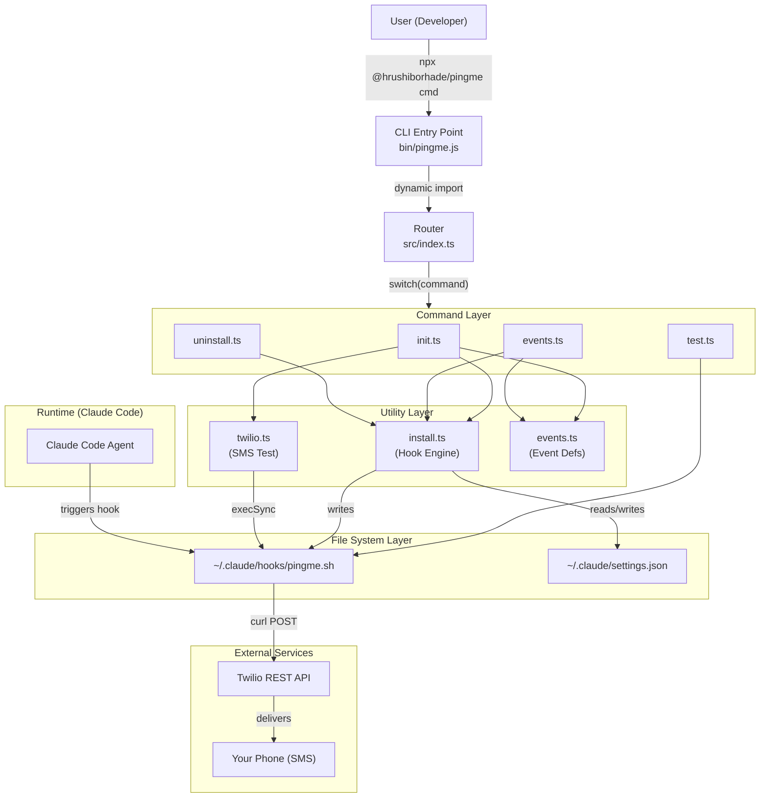

### Layer Responsibilities

**CLI Entry Point (`bin/pingme.js`):** A two-line shim that bootstraps the ESM module system and imports the compiled `dist/index.js`. This file is what npm installs as the `pingme` binary.

**Router (`src/index.ts`):** Parses `process.argv`, extracts the command name, and dispatches to the appropriate command handler via a `switch` statement. Also handles `--version` and `--help` flags.

**Command Layer:** Each command is an isolated async function exported from its own module. Commands are responsible for user interaction (prompts, spinners, output formatting) and delegate heavy lifting to utilities.

**Utility Layer:** Pure logic modules with no user interaction. They handle file I/O, configuration management, event definitions, and script generation.

**File System Layer:** Two critical files that pingme creates and manages:
- `~/.claude/hooks/pingme.sh` -- the bash script that sends SMS
- `~/.claude/settings.json` -- Claude Code's configuration file where hooks are registered

**Runtime Layer:** Claude Code reads `settings.json` on startup, discovers the registered hooks, and executes `pingme.sh` when the corresponding events fire.

**External Services:** The hook script uses `curl` to make a POST request to Twilio's REST API, which delivers the SMS to your phone.

---

## 3. Directory Structure

```
pingme-cli/
|-- bin/
|   |-- pingme.js              # CLI entry point (npm bin)
|-- dist/                       # Compiled JavaScript output (gitignored)
|   |-- index.js
|   |-- index.d.ts
|   |-- commands/
|   |   |-- init.js
|   |   |-- events.js
|   |   |-- test.js
|   |   |-- uninstall.js
|   |-- utils/
|       |-- events.js
|       |-- install.js
|       |-- twilio.js
|-- scripts/
|   |-- release.sh             # Interactive release automation
|-- src/
|   |-- index.ts               # Main entry, CLI router
|   |-- commands/
|   |   |-- init.ts            # Setup wizard
|   |   |-- events.ts          # Event configuration
|   |   |-- test.ts            # Test SMS sender
|   |   |-- uninstall.ts       # Cleanup and removal
|   |-- utils/
|   |   |-- events.ts          # Event definitions (source of truth)
|   |   |-- install.ts         # Hook script generator and settings manager
|   |   |-- twilio.ts          # Twilio SMS test harness
|   |-- __tests__/
|       |-- utils/
|       |   |-- twilio.test.ts  # Hook script behavior tests
|       |   |-- install.test.ts # Escape logic and generation tests
|       |-- integration/
|           |-- cli.test.ts     # CLI integration tests
|-- .github/
|   |-- workflows/
|       |-- claude.yml          # Claude PR assistant
|       |-- claude-code-review.yml # Automated code review
|-- package.json
|-- tsconfig.json
|-- vitest.config.ts
|-- CHANGELOG.md
|-- SECURITY.md
|-- LICENSE
|-- README.md
|-- .gitignore
```

### Key Observations

- **Source in `src/`, output in `dist/`:** Standard TypeScript project layout. The `tsconfig.json` sets `rootDir: ./src` and `outDir: ./dist`.
- **Tests are excluded from compilation:** `tsconfig.json` excludes `src/__tests__` so test files never end up in the published package.
- **Only `bin/` and `dist/` are published:** The `files` array in `package.json` restricts what goes into the npm tarball.
- **No `src/` in the published package:** Users never see TypeScript source; they only get compiled JavaScript.

---

## 4. CLI Command Flow

When a user runs `npx @hrushiborhade/pingme <command>`, here is exactly what happens:

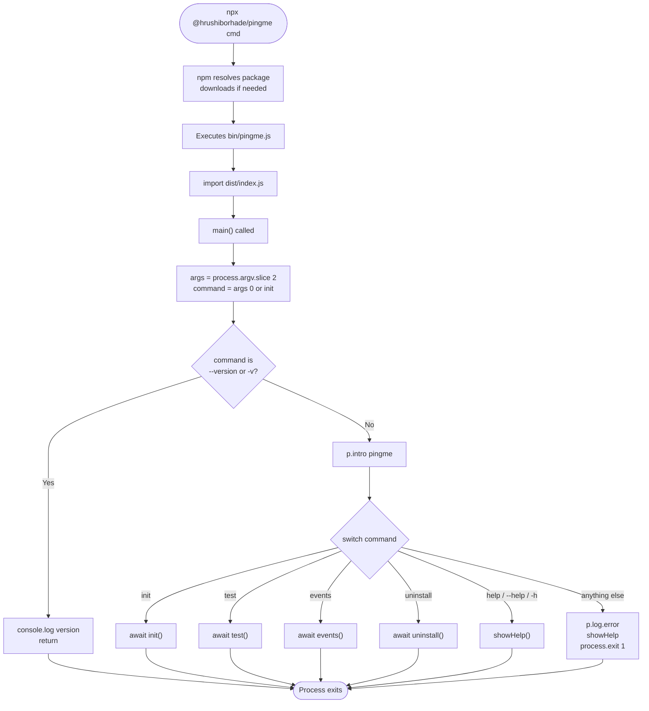

### Details of the Routing Logic

The router in `src/index.ts` is intentionally simple. There is no argument parsing library (like `commander` or `yargs`). The tool has only 4 commands plus version/help flags, so a plain `switch` statement is all that is needed.

```typescript
const args = process.argv.slice(2);
const command = args[0] || 'init';
```

If no command is provided, it defaults to `init`. This is a deliberate UX choice: a new user who just runs `npx @hrushiborhade/pingme` without arguments gets dropped into the setup wizard immediately.

The version flag is handled before the `p.intro()` header is printed, so `--version` gives clean output suitable for scripting (e.g., `pingme v1.2.2`).

The error handler at the bottom catches any unhandled promise rejections:

```typescript
main().catch((err) => {
  p.log.error(err.message);
  process.exit(1);
});
```

This ensures the process always exits with a non-zero code on failure, which is important for scripting and CI pipelines.

---

## 5. The Entry Point -- bin/pingme.js and src/index.ts

### bin/pingme.js

This file is remarkably simple -- just two lines:

```javascript
#!/usr/bin/env node
import('../dist/index.js');
```

The shebang line (`#!/usr/bin/env node`) tells the operating system to execute this file with Node.js. The dynamic `import()` (not `require()`) is used because the project is configured as an ESM module (`"type": "module"` in `package.json`).

**Why dynamic import instead of static?** The `bin` file is the entry point that npm symlinks into the user's `node_modules/.bin/`. It needs to resolve the path to `dist/index.js` relative to its own location. A static `import` would work too, but the dynamic form makes it clear that this is a bootstrapping boundary.

### src/index.ts

The main module does these things in order:

1. **Reads the version from `package.json`:** Uses `readFileSync` with `__dirname` computed from `import.meta.url` (the ESM equivalent of CommonJS `__dirname`).

```typescript
const __dirname = dirname(fileURLToPath(import.meta.url));
const packageJson = JSON.parse(
  readFileSync(join(__dirname, '../package.json'), 'utf-8')
);
const VERSION = packageJson.version;
```

This is a single-source-of-truth approach. The version lives only in `package.json`, and every other part of the system reads it from there. Earlier versions of the codebase had a hardcoded `VERSION` constant, which was changed in v1.2.0.

2. **Imports all command handlers:** Static imports at the top of the file.

3. **Defines `main()` and `showHelp()`:** The routing and help display logic.

4. **Calls `main()` with error handling:** The `.catch()` at the end.

---

## 6. Commands Deep Dive

### 6.1 init Command

**File:** `src/commands/init.ts`
**Purpose:** First-time setup wizard that collects Twilio credentials, lets the user select events, creates the hook script, and sends a test SMS.

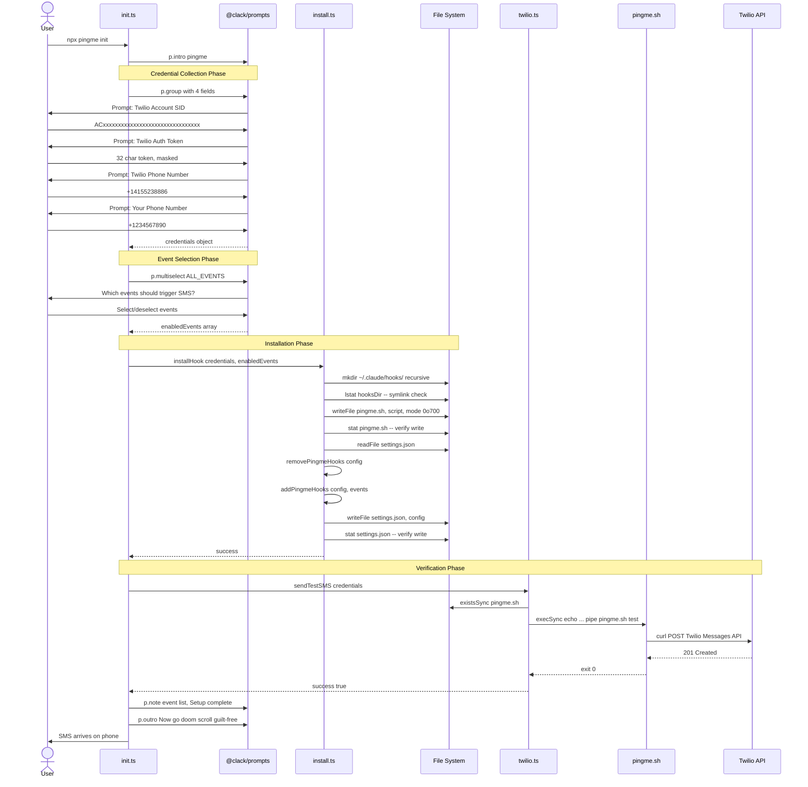

#### Credential Validation

Each credential field has strict validation:

- **Twilio SID:** Must match `/^AC[a-z0-9]{32}$/i` -- exactly 34 characters, starting with "AC", followed by 32 alphanumeric characters.
- **Twilio Auth Token:** Must match `/^[a-z0-9]{32}$/i` -- exactly 32 alphanumeric characters. This field uses `p.password()` which masks the input.
- **Phone Numbers (from and to):** Must match `/^\+\d{1,15}$/` -- E.164 format, a plus sign followed by 1 to 15 digits.

These validations run client-side before any network requests are made. They catch common mistakes (forgetting the `+` prefix, pasting a partial SID) with clear error messages.

#### Event Selection UI

The event selection uses `@clack/prompts` multiselect. Each option shows:
- The event's emoji
- The event's label
- A hint that shows either the description or "spammy" for high-frequency events

`initialValues` is set to `ALL_EVENTS.filter((e) => e.defaultEnabled)`, which pre-selects the 5 default events. The user can toggle any event on/off before confirming.

#### Two-Phase Installation

The `init` command does two things:

1. **Creates the hook script and updates settings.json** via `installHook()`. If this fails (e.g., permission denied), the process exits with code 1.

2. **Sends a test SMS** via `sendTestSMS()`. If this fails, the process does NOT exit. It warns the user but considers setup "complete" because the hook infrastructure is in place -- the SMS failure might be a transient network issue or a Twilio trial restriction (trial accounts can only send to verified numbers).

This is an intentional design choice: it is better to install the hooks and have a failed test SMS than to roll back everything because of a temporary Twilio issue.

### 6.2 events Command

**File:** `src/commands/events.ts`
**Purpose:** Reconfigure which events trigger SMS notifications without re-entering Twilio credentials.

This command is useful when:
- You initially enabled too many events and are getting spammed
- You want to temporarily enable a verbose event like `PreToolUse` for debugging
- You want to add events you skipped during `init`

#### How It Works

1. **Checks that pingme is installed** by looking for `~/.claude/hooks/pingme.sh`. If not found, directs the user to run `init`.

2. **Reads the current configuration** from `~/.claude/settings.json` to determine which events are currently enabled. It does this by scanning for hook entries whose command includes `pingme.sh`.

3. **Presents the multiselect** with current selections pre-checked. The user sees all 14 events and can toggle any of them.

4. **Updates `settings.json`** via `updateEvents()`, which removes all existing pingme hook entries and adds new ones for the selected events. This is a replace-all strategy -- simpler and safer than trying to diff the changes.

The key insight is that `events` never touches `pingme.sh`. The script itself handles all 14 event types in its `case` statement regardless of which events are registered in `settings.json`. The filtering happens at the Claude Code level -- it only triggers hooks for events that are registered.

### 6.3 test Command

**File:** `src/commands/test.ts`
**Purpose:** Send a test SMS to verify that the hook script and Twilio credentials are working correctly.

The test command is deliberately simple:

```typescript
execSync(`echo "Test ping from pingme" | "${hookPath}" test`, {
  timeout: 15000,
  stdio: 'ignore',
});
```

It pipes a test message into the hook script with the `test` event argument. This exercises the exact same code path that Claude Code uses when triggering a real hook, including:
- Reading the event argument from `$1`
- Reading context from stdin
- Constructing the SMS body
- Making the `curl` request to Twilio

The 15-second timeout is generous enough for slow network connections but prevents the command from hanging indefinitely.

### 6.4 uninstall Command

**File:** `src/commands/uninstall.ts`
**Purpose:** Cleanly remove all pingme artifacts -- the hook script and settings.json entries.

#### Safety Checks

1. **Existence check:** If `pingme.sh` is not found, it exits early with "Nothing to do".
2. **Permission check:** Uses `access(hookPath, constants.W_OK)` to verify the user has write permission before attempting deletion.
3. **Confirmation prompt:** Asks "Remove pingme?" with a `p.confirm()` dialog.

#### Cleanup Order

1. **Delete the hook script** (`~/.claude/hooks/pingme.sh`) via `unlink()`.
2. **Clean settings.json** via `cleanSettingsJson()`, which removes all pingme hook entries.

The settings cleanup is wrapped in a try-catch that ignores errors. The rationale: if the hook file is already gone, the user's primary goal is achieved. A failure to clean `settings.json` is non-fatal because orphaned hook entries in settings.json simply point to a nonexistent script, which Claude Code will silently ignore.

---

## 7. Utility Modules Deep Dive

### 7.1 utils/events.ts -- Event Definitions

**File:** `src/utils/events.ts`
**Purpose:** Single source of truth for all Claude Code hook events supported by pingme.

This module defines the `HookEventDef` interface and the `ALL_EVENTS` array. Every other module that needs to know about events imports from here.

#### The HookEventDef Interface

```typescript
export interface HookEventDef {
  event: string;        // Claude Code hook event name (e.g. "Stop", "PostToolUse")
  scriptArg: string;    // Argument passed to pingme.sh script (e.g. "stopped", "question")
  emoji: string;        // Emoji for SMS message
  label: string;        // Short label for display
  description: string;  // Human-readable description
  defaultEnabled: boolean; // Whether enabled by default
  matcher?: string;     // Optional matcher regex for hook
  spammy: boolean;      // Whether this event fires frequently
}
```

The `matcher` field is only used by the `PostToolUse` event, where it is set to `"AskUserQuestion"`. This tells Claude Code to only trigger this hook when the specific tool `AskUserQuestion` is used, not for every tool use.

The `scriptArg` is the string passed as `$1` to `pingme.sh`. It uses snake_case (e.g., `task_completed`, `subagent_stop`) for consistency with shell scripting conventions.

#### Helper Functions

- `getDefaultEvents()`: Returns only events with `defaultEnabled: true` (the 5 core events).
- `getEventByScriptArg(scriptArg)`: Looks up an event definition by its script argument. Useful for debugging and testing.

### 7.2 utils/install.ts -- Hook Installation Engine

**File:** `src/utils/install.ts`
**Purpose:** The core engine that generates the hook script, manages `settings.json`, and handles all file system operations.

This is the largest and most complex module in the project. Let's break it down section by section.

#### escapeForBash()

```typescript
function escapeForBash(str: string): string {
  return str
    .replace(/\\/g, '\\\\')    // Backslashes first
    .replace(/"/g, '\\"')       // Double quotes
    .replace(/\$/g, '\\$')     // Dollar signs
    .replace(/`/g, '\\`')      // Backticks
    .replace(/!/g, '\\!');     // Exclamation marks
}
```

This function is critical for security. It escapes characters that have special meaning in bash double-quoted strings. The order matters: backslashes must be escaped first, otherwise the escape characters added for other replacements would themselves be escaped.

Characters escaped:
- `\` -- literal backslash (could break out of strings)
- `"` -- double quote (could terminate the string)
- `$` -- dollar sign (could trigger variable expansion or command substitution via `$()`)
- backtick -- backtick (could trigger command substitution)
- `!` -- exclamation mark (history expansion in interactive bash)

This prevents shell injection attacks. If a user's Twilio token happened to contain `"; rm -rf /; echo "`, the escaping would produce `\"; rm -rf /; echo \"`, which bash interprets as a literal string rather than executable code.

#### The HOOK_SCRIPT Template

The hook script is defined as a TypeScript template literal that contains the full bash script. Template placeholders (`{{TWILIO_SID}}`, `{{TWILIO_TOKEN}}`, `{{TWILIO_FROM}}`, `{{MY_PHONE}}`) are replaced with escaped credential values during installation.

The script template also includes `${buildCaseEntries()}`, which dynamically generates the `case` statement for all 14 events from the `ALL_EVENTS` array. This means the script always knows about all events, even if only some are registered in `settings.json`.

The script's logic flow:
1. Check for `curl` availability (exit silently if not found)
2. Extract the event name from `$1`
3. Get the project name from `basename "$PWD"` (sanitized)
4. Get tmux info if running inside tmux
5. Read context from stdin (JSON or raw text)
6. Try to extract structured fields from JSON using `jq`
7. Fall back to raw text truncated to 280 characters
8. Look up the event emoji and reason from the `case` statement
9. Build the SMS body
10. Send via `curl` in a backgrounded subshell

#### buildCaseEntries()

This function generates the bash `case` statement entries for the hook script:

```typescript
function buildCaseEntries(): string {
  const entries = ALL_EVENTS.map(
    (e) => `    ${e.scriptArg}) EMOJI="${e.emoji}"; REASON="${e.label}" ;;`
  );
  entries.push(`    test)       EMOJI="test_emoji"; REASON="Test ping" ;;`);
  entries.push(`    *)          EMOJI="bell_emoji"; REASON="Needs attention" ;;`);
  return entries.join('\n');
}
```

It iterates over `ALL_EVENTS` to produce lines like:
```bash
    task_completed) EMOJI="..."; REASON="Task completed" ;;
    stopped)        EMOJI="..."; REASON="Agent stopped" ;;
```

Plus a `test` case for the test command and a wildcard `*` case for any unrecognized event.

#### Configuration Management

The `readConfig()` and `writeConfig()` functions handle `~/.claude/settings.json` with defensive error handling:

**readConfig():**
- Returns `{}` if the file does not exist (expected on first install)
- Returns `{}` if the file contains invalid JSON (with a warning message)
- Validates that the parsed value is a non-null object
- Catches and categorizes errors (ENOENT, SyntaxError, other)

**writeConfig():**
- Checks write permissions before attempting to write
- Uses `JSON.stringify(config, null, 2)` for pretty-printed output
- Verifies the written file is non-empty by checking `stat.size`

#### removePingmeHooks()

This function scans all hook entries in `settings.json` and removes any that reference `pingme.sh`. It:
- Validates the structure of each hook entry before manipulating it
- Uses type guards (`h is HookEntry`) for safe TypeScript narrowing
- Cleans up empty arrays and empty objects after removal
- Logs warnings for unexpected structures instead of crashing

#### addPingmeHooks()

This function adds hook entries for the selected events. Each entry has the structure:

```json
{
  "hooks": [
    {
      "type": "command",
      "command": "~/.claude/hooks/pingme.sh task_completed",
      "timeout": 10000
    }
  ]
}
```

For events with a `matcher` (currently only `PostToolUse` with `AskUserQuestion`), the entry includes a `matcher` field:

```json
{
  "matcher": "AskUserQuestion",
  "hooks": [
    {
      "type": "command",
      "command": "~/.claude/hooks/pingme.sh question",
      "timeout": 10000
    }
  ]
}
```

#### installHook()

The main installation function that orchestrates everything:

1. Create `~/.claude/hooks/` directory (recursive, idempotent)
2. Verify it is not a symlink (security check)
3. Generate the script with escaped credentials
4. Write the script with `mode: 0o700` (owner read/write/execute only)
5. Verify the write (check file size and permissions)
6. Read existing `settings.json`
7. Remove old pingme hooks
8. Add new pingme hooks
9. Write updated `settings.json`

#### updateEvents()

A lighter version of `installHook()` that only updates `settings.json` without regenerating the hook script. Used by the `events` command.

#### getEnabledEvents()

Reads `settings.json` and determines which events are currently enabled by looking for hook entries containing `pingme.sh` in their command. Returns an array of `HookEventDef` objects.

#### cleanSettingsJson()

Used by the `uninstall` command. Removes all pingme hook entries from `settings.json`.

### 7.3 utils/twilio.ts -- SMS Test Harness

**File:** `src/utils/twilio.ts`
**Purpose:** Sends a test SMS by executing the hook script and provides structured error reporting.

This module is more sophisticated than it might appear. It defines a `TestResult` type with structured error codes:

```typescript
export type TestErrorCode =
  | 'HOOK_NOT_FOUND'
  | 'TIMEOUT'
  | 'NETWORK_ERROR'
  | 'PERMISSION_DENIED'
  | 'SCRIPT_ERROR'
  | 'UNKNOWN';
```

The `getErrorCode()` function analyzes error messages from child process execution and categorizes them:
- Checks for timeout indicators (`ETIMEDOUT`, `timed out`, `SIGTERM` signal)
- Checks for network errors (`ENOTFOUND`, `ECONNREFUSED`, `ECONNRESET`)
- Checks for permission errors (`EACCES`, `permission denied`)
- Checks for script execution errors (non-zero exit codes)

Each error code maps to a user-friendly message via `getErrorMessage()`:
- `TIMEOUT` -> "Request timed out after 15 seconds. Check your network connection or Twilio service status."
- `NETWORK_ERROR` -> "Network error. Check your internet connection and try again."
- `PERMISSION_DENIED` -> "Permission denied. Check that the hook script is executable..."
- etc.

This categorization allows the `init` command to provide targeted troubleshooting advice instead of dumping raw error messages.

---

## 8. The Hook Script -- pingme.sh

The generated `pingme.sh` script is a standalone bash script that does not depend on Node.js at runtime. It is executed by Claude Code's hook system whenever a registered event fires.

### Script Structure

```bash
#!/usr/bin/env bash

# Config section (credentials embedded, escaped)
TWILIO_SID="ACxxxxxxxxxxxxxxxxxxxxxxxxxxxxxxxx"
TWILIO_TOKEN="xxxxxxxxxxxxxxxxxxxxxxxxxxxxxxxx"
TWILIO_FROM="+14155238886"
MY_PHONE="+1234567890"

# 1. Curl availability check
# 2. Event argument extraction
# 3. Project name extraction (sanitized)
# 4. tmux info detection
# 5. stdin reading
# 6. JSON context extraction (jq)
# 7. Raw text fallback (280 char truncation)
# 8. Event-specific emoji/reason lookup
# 9. SMS body construction
# 10. Background curl to Twilio API
```

### Key Design Decisions

**Credentials embedded in the script:** This is a deliberate trade-off. Alternatives considered:
- Environment variables: Would require the user to set them globally, which is worse for security (visible in `env` output, passed to all child processes)
- A separate config file: Would add complexity and another file to manage
- A keychain/credential store: Would add OS-specific dependencies

Embedding credentials in a file with `0o700` permissions (owner-only access) is the standard approach for shell scripts that need credentials.

**Background curl with disown:** The curl request is fired in a backgrounded subshell that is then disowned:

```bash
(
    curl -s -X POST "https://api.twilio.com/..." \
        --max-time 10 \
        > /dev/null 2>&1
) &
disown 2>/dev/null || true
```

This design ensures the hook script exits immediately (within milliseconds) so it does not block Claude Code. The SMS delivery happens asynchronously. The `--max-time 10` flag prevents the background curl from hanging forever.

**`disown` with fallback:** `disown` is a bash builtin that removes a job from the shell's job table. The `2>/dev/null || true` handles the case where the shell does not support `disown` (though this is unlikely with `bash`).

**Silent exit on missing curl:** If `curl` is not installed, the script exits with code 0 (success). This is intentional -- a missing dependency should not cause Claude Code's hook system to report errors.

**jq-based JSON extraction with fallback:** The script tries to extract structured fields from JSON input (tool_name, message, prompt, stop_reason) using `jq`. If `jq` is not available or the input is not JSON, it falls back to raw text truncated to 280 characters. This graceful degradation means the script works on any system, but provides richer context when `jq` is installed.

---

## 9. Event Flow: From Claude Code to Your Phone

This is the end-to-end flow of how a Claude Code event becomes an SMS on your phone:

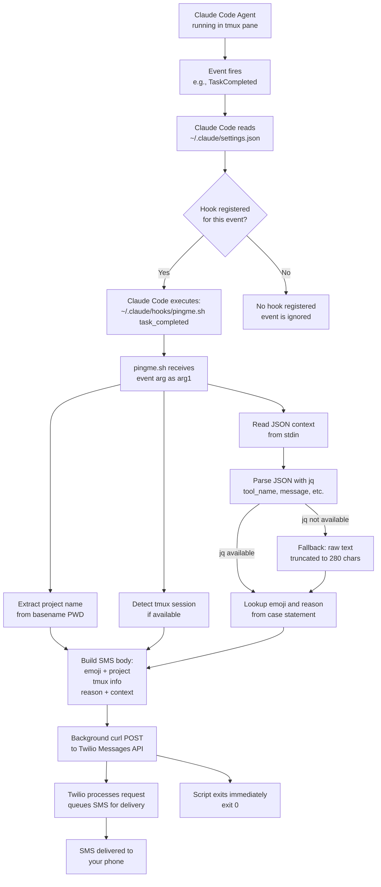

### Detailed Event Flow

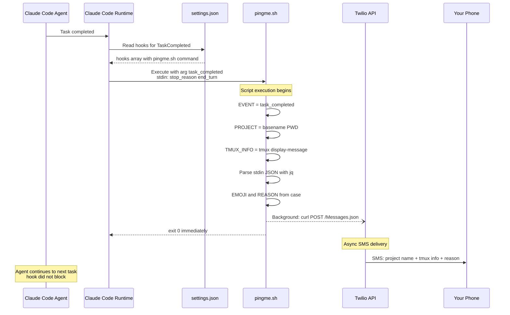

### What the SMS Looks Like

A typical SMS from pingme looks like:

```
[check emoji] agentQ
[pin emoji] dev:2.1 (main)
[speech emoji] Task completed
```

Breaking this down:
- Line 1: Event emoji + project name (from `basename $PWD`)
- Line 2: tmux session:window.pane (current branch) -- only present if running in tmux
- Line 3: Event reason text
- Line 4+: Additional context (if available from JSON input)

---

## 10. File Dependency Graph

This graph shows which source files import from which, revealing the internal module structure:

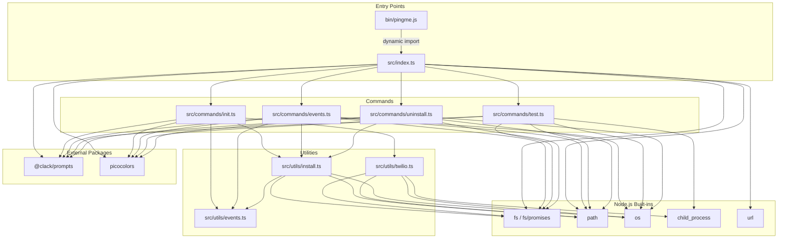

### Dependency Flow Analysis

The dependency graph reveals several important patterns:

1. **Events module is a leaf node:** `src/utils/events.ts` has zero internal imports. It only defines data structures and pure functions. This makes it easy to test and reason about.

2. **Install module is the central hub:** `src/utils/install.ts` is imported by 3 of the 4 commands (init, events, uninstall). It is the most critical module in the system.

3. **Twilio module is isolated:** `src/utils/twilio.ts` is only imported by `init.ts`. It handles a single concern (testing SMS delivery) and does not depend on any other internal module.

4. **Commands depend on utilities, never on each other:** There are no cross-command imports. Each command is self-contained with its utility dependencies.

5. **Only 2 external packages:** `@clack/prompts` and `picocolors`. Everything else is Node.js built-ins.

---

## 11. Security Model

pingme implements multiple layers of security to protect against shell injection, credential exposure, and file system attacks.

```mermaid
flowchart TB
    Input["User Input<br/>Twilio credentials, phone numbers"]

    subgraph Layer1["Layer 1: Input Validation"]
        SID_V["SID Validation<br/>AC followed by 32 alphanumeric chars"]
        Token_V["Token Validation<br/>32 alphanumeric chars"]
        Phone_V["Phone Validation<br/>E.164 format: + then 1-15 digits"]
    end

    subgraph Layer2["Layer 2: Shell Injection Prevention"]
        Escape["escapeForBash<br/>Escape: backslash, quote, dollar, backtick, exclamation"]
    end

    subgraph Layer3["Layer 3: File System Security"]
        Symlink["Symlink Detection<br/>lstat check on hooks dir"]
        Perms["File Permissions<br/>mode: 0o700 owner only"]
        WriteCheck["Write Permission Check<br/>access dir W_OK"]
        Integrity["Integrity Verification<br/>stat.size after write"]
    end

    subgraph Layer4["Layer 4: Runtime Safety"]
        Sanitize["Project Name Sanitization<br/>tr -cd alphanumeric dot underscore hyphen"]
        Truncate["Context Truncation<br/>head -c 280"]
        Filter["Non-printable Filtering<br/>tr -cd printable and space"]
        BgExec["Background Execution<br/>Detached curl with max-time"]
    end

    subgraph Layer5["Layer 5: Configuration Safety"]
        JSONValid["JSON Validation<br/>typeof check, null check"]
        TypeGuard["Type Guards<br/>HookEntry type narrowing"]
        ErrorRecovery["Error Recovery<br/>Fallback to empty config"]
    end

    Input --> Layer1
    Layer1 -->|"validated"| Layer2
    Layer2 -->|"escaped"| Layer3
    Layer3 -->|"secured files"| Layer4
    Layer4 -->|"safe runtime"| Layer5
```

### Layer-by-Layer Breakdown

#### Layer 1: Input Validation

Before credentials are ever written to disk, they are validated against strict regex patterns. This catches:
- Injection attempts in the SID field (must start with "AC", must be exactly 34 chars)
- Malicious characters in the token (must be alphanumeric only)
- Invalid phone numbers (must be E.164 format)

Any input that fails validation is rejected with a specific error message, and the user is prompted to re-enter.

#### Layer 2: Shell Injection Prevention

The `escapeForBash()` function neutralizes all bash metacharacters. Consider this attack:

```
User enters SID: AC"; rm -rf /; echo "
```

After escaping: `AC\"; rm -rf /; echo \"`

When placed in the script:
```bash
TWILIO_SID="AC\"; rm -rf /; echo \""
```

Bash interprets the escaped quotes as literal characters, not string terminators. The `rm -rf /` is treated as part of the string value, not as a command.

#### Layer 3: File System Security

- **Symlink detection:** Before writing to `~/.claude/hooks/`, the installer checks if the directory is a symlink using `lstat()`. An attacker could create a symlink from `~/.claude/hooks/` to `/etc/` or another sensitive directory. The symlink check prevents this.

- **Restrictive permissions:** The hook script is created with mode `0o700` (rwx------), meaning only the file owner can read, write, or execute it. On shared systems, other users cannot read the embedded credentials.

- **Write permission checks:** Before writing to `settings.json`, the installer verifies it has write access to the directory. This provides a clear error message instead of a cryptic EACCES error.

- **Write verification:** After writing files, the installer reads back the file's `stat` to verify the write succeeded (file size > 0, correct permissions).

#### Layer 4: Runtime Safety

- **Project name sanitization:** `tr -cd '[:alnum:]._-'` strips all characters except alphanumeric, dots, underscores, and hyphens. This prevents injection via directory names.

- **Context truncation:** All context text is truncated to 280 characters. This prevents excessively long SMS messages and limits the impact of any unexpected input.

- **Non-printable character filtering:** `tr -cd '[:print:][:space:]'` removes control characters and other non-printable bytes that could cause issues in SMS delivery.

- **Background execution with timeout:** The curl request runs in a detached background process with `--max-time 10`. This ensures the hook script never blocks Claude Code, even if Twilio's API is slow or unreachable.

#### Layer 5: Configuration Safety

- **JSON validation:** The `readConfig()` function validates that the parsed JSON is a non-null object before using it.

- **Type guards:** Hook entries are filtered through TypeScript type guards (`h is HookEntry`) before manipulation.

- **Error recovery:** If `settings.json` is corrupted (invalid JSON), the system falls back to an empty configuration instead of crashing. It logs a warning so the user is aware.

---

## 12. Build Pipeline

The build pipeline transforms TypeScript source into publishable JavaScript:

```mermaid
flowchart LR
    subgraph Source["Source: src/"]
        TS1["index.ts"]
        TS2["commands/init.ts"]
        TS3["commands/events.ts"]
        TS4["commands/test.ts"]
        TS5["commands/uninstall.ts"]
        TS6["utils/events.ts"]
        TS7["utils/install.ts"]
        TS8["utils/twilio.ts"]
    end

    subgraph Compiler["TypeScript Compiler tsc"]
        TSC["tsc<br/>target: ES2022<br/>module: NodeNext<br/>strict: true<br/>declaration: true"]
    end

    subgraph Output["Output: dist/"]
        JS1["index.js + index.d.ts"]
        JS2["commands/init.js + .d.ts"]
        JS3["commands/events.js + .d.ts"]
        JS4["commands/test.js + .d.ts"]
        JS5["commands/uninstall.js + .d.ts"]
        JS6["utils/events.js + .d.ts"]
        JS7["utils/install.js + .d.ts"]
        JS8["utils/twilio.js + .d.ts"]
    end

    subgraph Bin["Binary Entry"]
        BIN["bin/pingme.js<br/>static, not compiled"]
    end

    subgraph Publish["npm Package"]
        PKG["@hrushiborhade/pingme<br/>bin/ + dist/"]
    end

    subgraph UserMachine["User Machine"]
        NPX["npx @hrushiborhade/pingme"]
    end

    Source --> TSC
    TSC --> Output
    Output --> PKG
    BIN --> PKG
    PKG -->|"npm publish"| Registry["npm Registry"]
    Registry -->|"npx downloads"| NPX
```

### TypeScript Configuration

The `tsconfig.json` specifies:

```json
{
  "compilerOptions": {
    "target": "ES2022",
    "module": "NodeNext",
    "moduleResolution": "NodeNext",
    "outDir": "./dist",
    "rootDir": "./src",
    "strict": true,
    "esModuleInterop": true,
    "skipLibCheck": true,
    "forceConsistentCasingInFileNames": true,
    "resolveJsonModule": true,
    "declaration": true
  },
  "include": ["src/**/*"],
  "exclude": ["node_modules", "dist", "src/__tests__"]
}
```

Key settings explained:

- **`target: ES2022`**: Compiles to modern JavaScript that supports top-level await, private class fields, and other ES2022 features. Node.js 18+ supports all of these natively.

- **`module: NodeNext`**: Uses Node.js's native ESM module system. Import specifiers must include the `.js` extension (e.g., `import { init } from './commands/init.js'`), which maps correctly to the compiled output.

- **`moduleResolution: NodeNext`**: Resolves modules using Node.js's ESM resolution algorithm.

- **`strict: true`**: Enables all strict type checking options (strictNullChecks, strictFunctionTypes, strictBindCallApply, strictPropertyInitialization, noImplicitAny, noImplicitThis, alwaysStrict).

- **`declaration: true`**: Generates `.d.ts` type declaration files alongside the compiled `.js` files. This allows the package to be used as a library (though it is primarily a CLI tool).

- **`exclude: ["src/__tests__"]`**: Test files are never compiled into the `dist/` directory. They exist only in source and are run directly by Vitest.

### The Build Command

```bash
npm run build  # equivalent to: tsc
```

This compiles all `.ts` files in `src/` (excluding tests) to `.js` files in `dist/`, preserving the directory structure.

---

## 13. Release Strategy

pingme supports two release strategies: an interactive script for careful releases and a one-liner for quick patches.

```mermaid
flowchart TB
    subgraph Interactive["Strategy 1: Interactive Release via scripts/release.sh"]
        I1["Run: npm run release"]
        I2["Check for uncommitted changes"]
        I3{"Working directory clean?"}
        I4["Display current version"]
        I5["Prompt: patch / minor / major"]
        I6["Run npm test"]
        I7["Run npm run build"]
        I8["Run npm audit"]
        I9["npm version --no-git-tag-version"]
        I10["git add package.json package-lock.json"]
        I11["git commit -m chore: bump version"]
        I12["git tag -a vX.Y.Z"]
        I13["Display next steps:<br/>1. git show<br/>2. git push origin main --tags<br/>3. npm publish"]
        I_FAIL["Exit with error"]

        I1 --> I2 --> I3
        I3 -->|Yes| I4 --> I5 --> I6 --> I7 --> I8
        I3 -->|No| I_FAIL
        I8 --> I9 --> I10 --> I11 --> I12 --> I13
    end

    subgraph Quick["Strategy 2: Quick Release via npm scripts"]
        Q1["Run: npm run release:patch"]
        Q2["npm test via preversion hook"]
        Q3["npm run build via preversion hook"]
        Q4["npm version patch<br/>bumps version, creates commit + tag"]
        Q5["git push origin main --tags<br/>via postversion hook"]
        Q6["Manually run: npm publish"]

        Q1 --> Q2 --> Q3 --> Q4 --> Q5 --> Q6
    end

    style Interactive fill:#e1f5fe
    style Quick fill:#fff3e0
```

### Strategy 1: Interactive Release (release.sh)

The `scripts/release.sh` script provides a guided release experience:

1. **Clean working directory check:** Uses `git status -s` to ensure there are no uncommitted changes. This prevents accidentally including work-in-progress in a release.

2. **Version display:** Shows the current version from `package.json` so the developer knows the starting point.

3. **Version bump selection:** Interactive prompt with three choices:
   - `1) patch` (1.2.0 -> 1.2.1) -- Bug fixes
   - `2) minor` (1.2.0 -> 1.3.0) -- New features
   - `3) major` (1.2.0 -> 2.0.0) -- Breaking changes

4. **Pre-release checks:**
   - Runs the full test suite (`npm test`)
   - Builds the project (`npm run build`)
   - Runs a security audit (`npm audit`)

5. **Version bump:** Uses `npm version $BUMP_TYPE --no-git-tag-version` to update `package.json` and `package-lock.json` without creating a git commit or tag (the script handles those manually for more control).

6. **Git operations:** Creates a commit and annotated tag with descriptive messages.

7. **Summary:** Displays the next manual steps (push, publish) without executing them. This gives the developer a chance to review (`git show`) before pushing.

### Strategy 2: Quick Release (npm scripts)

For routine patches, the `release:patch` script chain automates everything:

```json
{
  "release:patch": "npm version patch && git push origin main --tags",
  "preversion": "npm test && npm run build",
  "postversion": "git push origin main --tags"
}
```

The `npm version patch` command:
1. Triggers `preversion` hook: runs tests and build
2. Bumps the patch version in `package.json`
3. Creates a git commit with message "1.2.3"
4. Creates a git tag `v1.2.3`
5. Triggers `postversion` hook: pushes to remote with tags

Note: `release:patch` also has `git push` in its own command AND in `postversion`, which means the push happens twice. This is redundant but harmless -- the second push is a no-op.

After the push, `npm publish` must be run manually. This is intentional: publishing to npm is an irreversible action, so it requires explicit human confirmation.

---

## 14. Semver Decision Tree

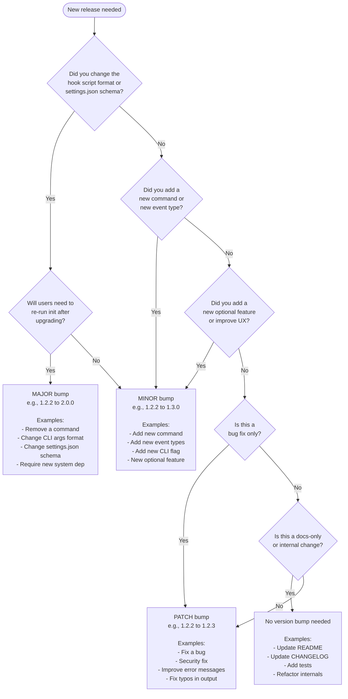

### Version History

| Version | Bump Type | Reason |
|---------|-----------|--------|
| 1.0.0 | Initial | First public release |
| 1.1.0 | Minor | Added all 14 Claude Code hook events + configurable event selection |
| 1.1.1 | Patch | Synced package-lock.json version |
| 1.2.0 | Minor | Comprehensive security fixes (permissions, symlink protection, JSON validation) |
| 1.2.1 | Patch | Fixed package.json bin path, normalized repo URL |
| 1.2.2 | Patch | Fixed all package name references to @hrushiborhade/pingme |

---

## 15. npm Publish Pipeline

When you run `npm publish`, npm creates a tarball containing only the files specified in the `files` array in `package.json`, plus a few always-included files.

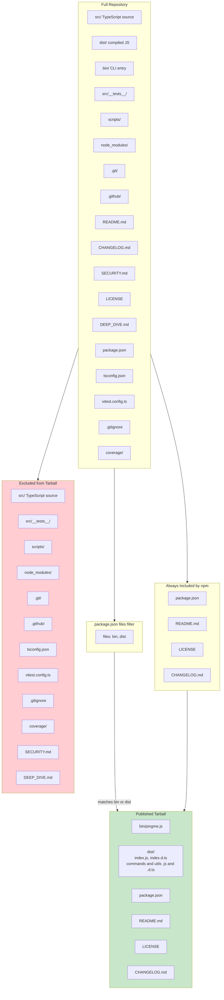

### What Gets Published

The `files` field in `package.json` acts as a whitelist:

```json
"files": [
  "bin",
  "dist"
]
```

This means only the `bin/` and `dist/` directories are included. npm also always includes `package.json`, `README.md`, `LICENSE`, and `CHANGELOG.md` regardless of the `files` setting.

### What Gets Excluded

Everything not in the whitelist is excluded:
- **Source code (`src/`):** Users do not need TypeScript source; they get compiled JavaScript.
- **Tests (`src/__tests__/`):** Doubly excluded -- not in `files` AND excluded from `tsconfig.json`.
- **Configuration files:** `tsconfig.json`, `vitest.config.ts`, `.gitignore` -- not needed at runtime.
- **Development artifacts:** `node_modules/`, `coverage/`, `.git/` -- standard exclusions.
- **CI/CD:** `.github/` -- workflows are only relevant for contributors.
- **Documentation extras:** `SECURITY.md`, `DEEP_DIVE.md` -- available on GitHub but not in the package.

### Why This Matters

A lean package:
1. Downloads faster with `npx` (especially important since `npx` downloads on every invocation if not cached)
2. Reduces attack surface (no source code to analyze for vulnerabilities)
3. Avoids shipping test fixtures or development scripts

---

## 16. Git Tag Timeline

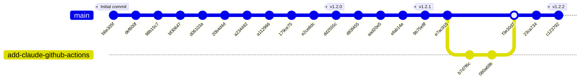

### Tag Details

| Tag | Commit | Date | Key Changes |
|-----|--------|------|-------------|
| v1.2.0 | `dd2555c` | 2026-02-09 | Security overhaul: permissions, symlink check, JSON validation |
| v1.2.1 | `9b75e8f` | 2026-02-09 | Fixed npm package.json bin path, correct package name |
| v1.2.2 | `c123792` | 2026-02-09 | Fixed all remaining pingme-cli references to @hrushiborhade/pingme |

Note: v1.0.0 and v1.1.0/v1.1.1 were released before the v1.2.0 tag was created. Early releases were tagged differently or the tags were not pushed. The git history shows the commits but the local tags start from v1.2.0.

### Branch History

The repository has been primarily developed on `main`. The only branch in the history is `add-claude-github-actions`, which was a short-lived feature branch for adding GitHub Actions workflows (Claude Code Review and Claude PR Assistant). It was merged via Pull Request #1.

---

## 17. Testing Strategy

pingme uses Vitest as its test runner with three categories of tests:

### Test Configuration

```typescript
// vitest.config.ts
export default defineConfig({
  test: {
    globals: true,
    environment: 'node',
    include: ['src/**/*.test.ts'],
    coverage: {
      provider: 'v8',
      reporter: ['text', 'html'],
      exclude: ['node_modules/', 'dist/', '**/*.test.ts', 'vitest.config.ts'],
    },
    testTimeout: 10000,
  },
});
```

Key settings:
- **`globals: true`**: Makes `describe`, `it`, `expect`, `beforeEach`, `afterEach` available globally without importing.
- **`environment: 'node'`**: Runs tests in Node.js (not jsdom or happy-dom).
- **`include: ['src/**/*.test.ts']`**: Finds test files by glob pattern.
- **`testTimeout: 10000`**: 10-second timeout per test (needed for shell execution tests).

### Test File: utils/install.test.ts

Tests the hook script generation and escaping logic.

**escapeForBash tests:**
- Escapes double quotes (`test"value` -> `test\"value`)
- Escapes dollar signs (`$HOME` -> `\$HOME`)
- Escapes backticks (backtick-whoami-backtick -> escaped safely)
- Escapes backslashes (`path\to\file` -> `path\\to\\file`)
- Escapes exclamation marks (`hello!world` -> `hello\!world`)
- Handles complex injection attempts (`"; rm -rf /; echo "` -> escaped safely)
- Handles command substitution (`$(cat /etc/passwd)` -> `\$(cat /etc/passwd)`)
- Handles empty strings
- Does not modify safe strings (alphanumeric only)

**Settings JSON generation tests:**
- Validates hook entry format with matcher
- Validates Stop hook without matcher

### Test File: utils/twilio.test.ts

Tests hook script runtime behavior by creating actual bash scripts in a temp directory and executing them.

**Event handling tests:**
- Handles question event (case statement routing)
- Handles stopped event
- Handles test event
- Defaults to "unknown" for missing event argument

**Stdin handling tests:**
- Reads context from stdin
- Truncates long stdin to 280 characters

**Project name extraction tests:**
- Extracts project name from `$PWD`
- Sanitizes project name (only alphanumeric, dots, underscores, hyphens)

**Curl check tests:**
- Detects curl availability

**Background execution tests:**
- Verifies script exits immediately (does not wait for background process)

**Error code detection tests:**
- Categorizes timeout errors
- Categorizes network errors
- Categorizes permission errors

### Test File: integration/cli.test.ts

Integration tests that execute the actual CLI binary.

**CLI command tests:**
- `--version` and `-v` output matches `pingme v{semver}` pattern
- `help`, `--help`, `-h` output includes "Usage:", "init", "test", "uninstall"
- Unknown commands exit with code 1

**Shell injection prevention tests:**
- Escaped double quotes do not execute
- Escaped command substitution does not execute
- Escaped backticks do not execute

Each test creates a script in a temp directory with deliberately malicious content, executes it, and verifies that no file was created by the injection attempt.

**Input validation logic tests:**
- Valid SID starts with "AC"
- Invalid SID is rejected
- Phone with country code is accepted
- Phone without country code is rejected
- Token with sufficient length is accepted
- Short token is rejected

### Running Tests

```bash
npm test              # Run all tests once
npm run test:watch    # Run tests in watch mode (re-run on file changes)
npm run test:coverage # Run tests with V8 code coverage
```

---

## 18. GitHub Actions CI/CD

The repository has two GitHub Actions workflows:

### Claude Code Review (.github/workflows/claude-code-review.yml)

Triggers on: Pull request events (opened, synchronize, ready_for_review, reopened)

This workflow uses the `anthropics/claude-code-action@v1` action to automatically review pull requests using Claude Code. It:
- Checks out the repository
- Runs Claude's code review plugin
- Posts review comments on the PR

Required permissions: read access to contents, pull requests, and issues; write access to id-token (for OAuth).

### Claude PR Assistant (.github/workflows/claude.yml)

Triggers on: Issue comments, PR review comments, issue events, PR review events -- but only when `@claude` is mentioned.

This workflow allows maintainers to interact with Claude by mentioning `@claude` in:
- Issue comments
- Pull request review comments
- New issues (in title or body)
- Pull request reviews

It provides Claude with read access to actions (so it can check CI results) and responds to the specific instructions in the comment that tagged it.

---

## 19. Dependencies Analysis

### Production Dependencies

| Package | Version | Size | Purpose |
|---------|---------|------|---------|
| `@clack/prompts` | ^0.9.1 | ~50KB | Beautiful CLI prompts (text input, password, multiselect, spinner, etc.) |
| `picocolors` | ^1.1.1 | ~3KB | Terminal color formatting (bold, dim, cyan, red, etc.) |

**Total production dependencies: 2**

This is an extremely lean dependency tree. Both packages are well-maintained, widely used, and have minimal transitive dependencies.

**Why @clack/prompts?**
`@clack/prompts` provides a cohesive, visually attractive CLI experience with proper cancellation handling, input validation, and spinner support. Alternatives like `inquirer` are larger and more complex. `@clack/prompts` is specifically designed for modern CLI tools and has a functional API that fits well with the codebase's style.

**Why picocolors?**
`picocolors` is the smallest color library available (~3KB, zero dependencies). Alternatives like `chalk` are significantly larger. Since pingme only needs basic color formatting, `picocolors` is the right choice.

### Dev Dependencies

| Package | Version | Purpose |
|---------|---------|---------|
| `@types/node` | ^20.10.0 | TypeScript type definitions for Node.js |
| `@vitest/coverage-v8` | ^4.0.18 | V8-based code coverage for Vitest |
| `typescript` | ^5.3.0 | TypeScript compiler |
| `vitest` | ^4.0.18 | Test runner |

### System Dependencies (Runtime)

These are not npm packages -- they are system utilities used by the generated hook script:

| Utility | Required? | Purpose |
|---------|-----------|---------|
| `curl` | Yes | Makes HTTP requests to Twilio API |
| `jq` | Optional | Parses JSON context from hook stdin |
| `tmux` | Optional | Detects tmux session/window/pane info |
| `bash` | Yes | Shell interpreter for the hook script |

The hook script gracefully degrades when optional dependencies are missing:
- Without `jq`: Falls back to raw text context
- Without `tmux`: Omits tmux info from SMS
- Without `curl`: Exits silently (no SMS sent)

---

## 20. Configuration Files

### package.json

Key fields and their purposes:

```json
{
  "name": "@hrushiborhade/pingme",
  "version": "1.2.2",
  "description": "Get texted when your Claude agent is stuck",
  "type": "module",
  "bin": {
    "pingme": "bin/pingme.js"
  },
  "main": "./dist/index.js",
  "files": ["bin", "dist"],
  "engines": {
    "node": ">=18"
  }
}
```

**Scoped package name:** The `@hrushiborhade/` scope prevents name collisions. The unscoped name `pingme` was likely taken on npm.

**`"type": "module"`:** Declares the entire package as ESM. All `.js` files are treated as ES modules. This is why `import()` is used in `bin/pingme.js` instead of `require()`.

**`"bin"` field:** When this package is installed globally or via `npx`, npm creates a symlink from `pingme` to `bin/pingme.js`. This is how `npx @hrushiborhade/pingme` resolves to the correct file.

**`"engines"` field:** Declares Node.js 18 as the minimum version. This is enforced by npm when installing with `engine-strict` config. ES2022 features used in the compiled output require Node.js 18+.

### tsconfig.json

Already covered in the Build Pipeline section. Key points:
- `rootDir: ./src` and `outDir: ./dist` define the source-to-output mapping
- `strict: true` enables all strict checks
- `declaration: true` generates `.d.ts` files
- Tests are excluded from compilation

### vitest.config.ts

Already covered in the Testing Strategy section.

### .gitignore

```
node_modules/
dist/
*.log
.DS_Store
coverage/
```

Standard ignores:
- `node_modules/` -- installed dependencies (reconstructed from `package-lock.json`)
- `dist/` -- compiled output (reconstructed from `npm run build`)
- `*.log` -- npm debug logs
- `.DS_Store` -- macOS metadata files
- `coverage/` -- test coverage reports

---

## 21. Troubleshooting Guide

### Common Issues and Solutions

#### Issue: SMS not sending after init

**Symptoms:** `init` completes but no SMS arrives.

**Diagnosis steps:**
1. Run `npx @hrushiborhade/pingme test` to isolate the problem.
2. Check Twilio console (https://console.twilio.com) for error logs.

**Common causes:**
- **Twilio trial account restriction:** Trial accounts can only send SMS to verified phone numbers. Verify your phone number in the Twilio console under Phone Numbers > Verified Caller IDs.
- **Insufficient balance:** Free trial includes $15 credit. Check your balance in the Twilio console.
- **Wrong phone format:** Both "From" and "To" numbers must include the country code with `+` prefix (e.g., `+14155238886`).
- **curl not installed:** The hook script requires `curl`. Check with `which curl`.

#### Issue: Hook not triggering

**Symptoms:** Claude Code events fire but no SMS is sent.

**Diagnosis steps:**
1. Verify hooks exist in `~/.claude/settings.json`:
   ```bash
   cat ~/.claude/settings.json | jq '.hooks'
   ```
2. Verify the hook script exists and is executable:
   ```bash
   ls -la ~/.claude/hooks/pingme.sh
   ```
3. Test the script manually:
   ```bash
   echo "test" | ~/.claude/hooks/pingme.sh test
   ```

**Common causes:**
- **Claude Code restart needed:** Hooks are loaded on startup. Restart Claude Code after running `init` or `events`.
- **Script not executable:** Run `chmod +x ~/.claude/hooks/pingme.sh`.
- **settings.json not updated:** Re-run `npx @hrushiborhade/pingme init`.

#### Issue: Permission denied during init

**Symptoms:** `init` fails with "Permission denied" or "Cannot write to ..." error.

**Common causes:**
- **`~/.claude/` owned by root:** This can happen if Claude Code was run with `sudo` at some point. Fix with `sudo chown -R $USER ~/.claude/`.
- **Disk full:** Check available space with `df -h`.
- **Read-only filesystem:** Check if the filesystem is mounted read-only.

#### Issue: Too many SMS notifications

**Solution:** Run `npx @hrushiborhade/pingme events` and deselect the events that fire too frequently. The `PreToolUse` and `UserPromptSubmit` events are marked as "spammy" for this reason.

#### Issue: Garbled SMS content

**Possible causes:**
- **Non-UTF8 characters in project directory name:** The hook script sanitizes the project name with `tr -cd '[:alnum:]._-'`, but extremely unusual directory names might produce empty strings.
- **Binary content in hook stdin:** If Claude Code passes binary data to the hook, the `jq` parser will fail and the fallback will truncate to 280 characters of whatever is readable.

---

## 22. Design Decisions and Trade-offs

### Why Bash for the Hook Script?

Claude Code's hook system executes commands via the shell. Using a bash script:
- **Zero additional runtime dependencies:** No need for Node.js at hook execution time.
- **Instant startup:** Bash scripts start in milliseconds. A Node.js script would need to bootstrap the runtime (~100-200ms), which could delay Claude Code.
- **Background execution:** Bash's `&` and `disown` provide simple, reliable background execution.

Trade-off: The script is harder to test and maintain than equivalent TypeScript code. This is mitigated by generating the script from a TypeScript template, which catches structural errors at build time.

### Why Twilio Instead of Other Providers?

- **Reliability:** Twilio has 99.95% uptime SLA for SMS delivery.
- **Simple API:** A single `curl` POST request. No SDK needed.
- **Free trial:** $15 credit is enough for thousands of SMS messages during evaluation.
- **Global reach:** Supports phone numbers in 180+ countries.

Trade-off: Twilio costs money after the trial. Future versions could support additional providers (Slack webhooks, Discord, Pushover, email).

### Why @clack/prompts Instead of inquirer?

- **Smaller:** ~50KB vs ~200KB+ for inquirer
- **Modern:** Built for ESM, uses modern Node.js APIs
- **Beautiful:** Consistent visual style with no configuration needed
- **Cancellation handling:** Built-in `isCancel()` check for Ctrl+C

Trade-off: Less community adoption than inquirer, fewer prompt types. But pingme only needs text input, password input, multiselect, confirm, and spinner -- all of which @clack/prompts handles well.

### Why No Rate Limiting?

The hook script does not implement rate limiting. Reasons:
- **Complexity vs. value:** Bash-based rate limiting (using lock files and timestamps) would be fragile and hard to maintain.
- **User control:** Users can disable spammy events via the `events` command.
- **Twilio rate limits:** Twilio enforces its own rate limits (1 SMS/second for long codes), which provides a natural throttle.
- **Statelessness:** Each hook invocation is independent -- there is no shared state between invocations to track rates.

Trade-off: A user who enables all 14 events on a busy agent could receive hundreds of SMS per hour. The `events` command and the "spammy" hint in the UI mitigate this.

### Why Not Use Environment Variables for Credentials?

Environment variables were considered and rejected:
- **Visibility:** `env` and `/proc/*/environ` expose environment variables to other processes.
- **Inheritance:** Environment variables are inherited by child processes, potentially leaking credentials.
- **Persistence:** The user would need to add them to `.bashrc`/`.zshrc`, which is more invasive than a file in `~/.claude/hooks/`.

Embedded credentials in a `0o700` file are the standard approach for CLI tools that need to store secrets locally (see: AWS CLI `~/.aws/credentials`, kubectl `~/.kube/config`).

### Why ESM Instead of CommonJS?

- **Future-proof:** ESM is the official JavaScript module standard.
- **Node.js support:** Node.js 18+ has stable ESM support.
- **Top-level await:** ESM supports top-level `await`, which simplifies async initialization.
- **`import.meta.url`:** ESM provides `import.meta.url` for reliable `__dirname` computation.

Trade-off: ESM requires `.js` extensions in import specifiers and has some edge cases with interop. These are well-understood in 2026.

---

## 23. Future Roadmap

Based on the Contributing section of the README and the architecture analysis, potential future enhancements include:

### Near-term (v1.3.x)
- **Rate limiting:** Cooldown period between SMS for the same event type (e.g., max 1 SMS per event per 5 minutes).
- **Quiet hours:** Configure time ranges when SMS should not be sent (e.g., 10pm-8am).
- **Custom message templates:** Allow users to customize the SMS format.

### Medium-term (v1.4.x - v1.5.x)
- **Multiple notification providers:**
  - Slack webhooks (post to a channel)
  - Discord webhooks
  - Pushover notifications
  - Email via SMTP
- **Per-project configuration:** Different events and notification channels for different projects.
- **Notification history:** Log sent notifications to a local file for debugging.

### Long-term (v2.0.0)
- **Web dashboard:** A simple web UI for configuring events and viewing notification history.
- **Agent coordination:** Use notifications to coordinate between multiple agents (e.g., "Agent A finished, Agent B can start").
- **Credential encryption:** Encrypt stored credentials with a master password or OS keychain integration.

---

## Appendix A: File Reference

| File | Lines | Purpose |
|------|-------|---------|
| `bin/pingme.js` | 2 | CLI entry point shim |
| `src/index.ts` | 78 | Main router and help display |
| `src/commands/init.ts` | 126 | Setup wizard |
| `src/commands/events.ts` | 83 | Event reconfiguration |
| `src/commands/test.ts` | 43 | Test SMS sender |
| `src/commands/uninstall.ts` | 59 | Cleanup and removal |
| `src/utils/events.ts` | 162 | Event definitions (source of truth) |
| `src/utils/install.ts` | 337 | Hook engine (largest module) |
| `src/utils/twilio.ts` | 133 | SMS test harness with error categorization |
| `scripts/release.sh` | 104 | Interactive release automation |
| `src/__tests__/utils/install.test.ts` | 138 | Escape and generation tests |
| `src/__tests__/utils/twilio.test.ts` | 212 | Hook script behavior tests |
| `src/__tests__/integration/cli.test.ts` | 145 | CLI integration tests |
| `package.json` | 58 | Package configuration |
| `tsconfig.json` | 18 | TypeScript configuration |
| `vitest.config.ts` | 16 | Test runner configuration |

## Appendix B: Generated settings.json Example

When all 5 default events are enabled, `~/.claude/settings.json` contains:

```json
{
  "hooks": {
    "TaskCompleted": [
      {
        "hooks": [
          {
            "type": "command",
            "command": "~/.claude/hooks/pingme.sh task_completed",
            "timeout": 10000
          }
        ]
      }
    ],
    "Stop": [
      {
        "hooks": [
          {
            "type": "command",
            "command": "~/.claude/hooks/pingme.sh stopped",
            "timeout": 10000
          }
        ]
      }
    ],
    "PostToolUse": [
      {
        "matcher": "AskUserQuestion",
        "hooks": [
          {
            "type": "command",
            "command": "~/.claude/hooks/pingme.sh question",
            "timeout": 10000
          }
        ]
      }
    ],
    "Notification": [
      {
        "hooks": [
          {
            "type": "command",
            "command": "~/.claude/hooks/pingme.sh notification",
            "timeout": 10000
          }
        ]
      }
    ],
    "PermissionRequest": [
      {
        "hooks": [
          {
            "type": "command",
            "command": "~/.claude/hooks/pingme.sh permission",
            "timeout": 10000
          }
        ]
      }
    ]
  }
}
```

## Appendix C: Generated pingme.sh Example

The generated hook script (with credentials redacted):

```bash
#!/usr/bin/env bash

# Config (do not edit manually)
TWILIO_SID="ACxxxxxxxxxxxxxxxxxxxxxxxxxxxxxxxx"
TWILIO_TOKEN="xxxxxxxxxxxxxxxxxxxxxxxxxxxxxxxx"
TWILIO_FROM="+14155238886"
MY_PHONE="+1234567890"

# Check for curl
if ! command -v curl &> /dev/null; then
    exit 0
fi

# Context
EVENT="${1:-unknown}"
PROJECT=$(basename "$PWD" | tr -cd '[:alnum:]._-')

# tmux info
TMUX_INFO=""
if [ -n "$TMUX" ]; then
    TMUX_INFO=$(tmux display-message -p '#S:#I.#P (#W)' 2>/dev/null || echo "")
fi

# Read stdin
RAW_INPUT=""
if [ ! -t 0 ]; then
    RAW_INPUT=$(cat)
fi

# JSON extraction with jq
CONTEXT=""
if command -v jq &> /dev/null && [ -n "$RAW_INPUT" ]; then
    TOOL_NAME=$(echo "$RAW_INPUT" | jq -r '.tool_name // empty' 2>/dev/null)
    MESSAGE=$(echo "$RAW_INPUT" | jq -r '.message // empty' 2>/dev/null)
    PROMPT=$(echo "$RAW_INPUT" | jq -r '.prompt // empty' 2>/dev/null)
    STOP_REASON=$(echo "$RAW_INPUT" | jq -r '.stop_reason // empty' 2>/dev/null)

    if [ -n "$TOOL_NAME" ]; then CONTEXT="Tool: $TOOL_NAME"; fi
    if [ -n "$MESSAGE" ]; then CONTEXT="${CONTEXT:+$CONTEXT\n}$MESSAGE"; fi
    if [ -n "$PROMPT" ]; then CONTEXT="${CONTEXT:+$CONTEXT\n}$PROMPT"; fi
    if [ -n "$STOP_REASON" ]; then CONTEXT="${CONTEXT:+$CONTEXT\n}Reason: $STOP_REASON"; fi
fi

# Fallback to raw text
if [ -z "$CONTEXT" ] && [ -n "$RAW_INPUT" ]; then
    CONTEXT=$(echo "$RAW_INPUT" | head -c 280 | tr -cd '[:print:][:space:]')
fi
CONTEXT=$(echo "$CONTEXT" | head -c 280)

# Event lookup
case "$EVENT" in
    task_completed) EMOJI="..."; REASON="Task completed" ;;
    stopped)        EMOJI="..."; REASON="Agent stopped" ;;
    question)       EMOJI="..."; REASON="Asking question" ;;
    notification)   EMOJI="..."; REASON="Notification" ;;
    permission)     EMOJI="..."; REASON="Needs permission" ;;
    # ... (all 14 events)
    test)           EMOJI="..."; REASON="Test ping" ;;
    *)              EMOJI="..."; REASON="Needs attention" ;;
esac

# Build and send SMS
SMS="$EMOJI $PROJECT"
[ -n "$TMUX_INFO" ] && SMS="$SMS\n[pin] $TMUX_INFO"
SMS="$SMS\n[speech] $REASON"
[ -n "$CONTEXT" ] && SMS="$SMS\n\n$CONTEXT"

(
    curl -s -X POST "https://api.twilio.com/2010-04-01/Accounts/$TWILIO_SID/Messages.json" \
        --user "$TWILIO_SID:$TWILIO_TOKEN" \
        --data-urlencode "From=$TWILIO_FROM" \
        --data-urlencode "To=$MY_PHONE" \
        --data-urlencode "Body=$SMS" \
        --max-time 10 \
        > /dev/null 2>&1
) &
disown 2>/dev/null || true

exit 0
```

## Appendix D: Full Import Map

Every import statement across all source files:

### src/index.ts
```typescript
import * as p from '@clack/prompts';
import pc from 'picocolors';
import { readFileSync } from 'fs';
import { fileURLToPath } from 'url';
import { dirname, join } from 'path';
import { init } from './commands/init.js';
import { test } from './commands/test.js';
import { uninstall } from './commands/uninstall.js';
import { events } from './commands/events.js';
```

### src/commands/init.ts
```typescript
import * as p from '@clack/prompts';
import pc from 'picocolors';
import { installHook } from '../utils/install.js';
import { sendTestSMS } from '../utils/twilio.js';
import { ALL_EVENTS, type HookEventDef } from '../utils/events.js';
```

### src/commands/events.ts
```typescript
import * as p from '@clack/prompts';
import pc from 'picocolors';
import { existsSync } from 'fs';
import { readFile } from 'fs/promises';
import { homedir } from 'os';
import path from 'path';
import { ALL_EVENTS, type HookEventDef } from '../utils/events.js';
import { getEnabledEvents, updateEvents } from '../utils/install.js';
```

### src/commands/test.ts
```typescript
import * as p from '@clack/prompts';
import pc from 'picocolors';
import { existsSync } from 'fs';
import { homedir } from 'os';
import path from 'path';
import { execSync } from 'child_process';
```

### src/commands/uninstall.ts
```typescript
import * as p from '@clack/prompts';
import pc from 'picocolors';
import { existsSync } from 'fs';
import { unlink, access, constants } from 'fs/promises';
import { homedir } from 'os';
import path from 'path';
import { cleanSettingsJson } from '../utils/install.js';
```

### src/utils/install.ts
```typescript
import { writeFile, readFile, mkdir, access, constants, stat, lstat } from 'fs/promises';
import { existsSync } from 'fs';
import path from 'path';
import { homedir } from 'os';
import { ALL_EVENTS, getDefaultEvents, type HookEventDef } from './events.js';
```

### src/utils/twilio.ts
```typescript
import { execSync, ExecSyncOptionsWithBufferEncoding } from 'child_process';
import { existsSync } from 'fs';
import { homedir } from 'os';
import path from 'path';
```

### src/utils/events.ts
```typescript
// No imports -- this module is a pure data/type definition
```

---

## Appendix E: Complete API Surface

### Exported Functions

| Module | Export | Type | Description |
|--------|--------|------|-------------|
| `commands/init.ts` | `init()` | `async function` | Setup wizard |
| `commands/events.ts` | `events()` | `async function` | Event reconfiguration |
| `commands/test.ts` | `test()` | `async function` | Test SMS |
| `commands/uninstall.ts` | `uninstall()` | `async function` | Cleanup |
| `utils/events.ts` | `ALL_EVENTS` | `HookEventDef[]` | All 14 event definitions |
| `utils/events.ts` | `getDefaultEvents()` | `function` | Returns 5 default events |
| `utils/events.ts` | `getEventByScriptArg()` | `function` | Lookup by script arg |
| `utils/install.ts` | `installHook()` | `async function` | Create script + update settings |
| `utils/install.ts` | `updateEvents()` | `async function` | Update settings only |
| `utils/install.ts` | `getEnabledEvents()` | `function` | Read enabled events from config |
| `utils/install.ts` | `cleanSettingsJson()` | `async function` | Remove all pingme entries |
| `utils/install.ts` | `_escapeForBash()` | `function` | Re-exported for testing |
| `utils/twilio.ts` | `sendTestSMS()` | `async function` | Send test SMS via hook |

### Exported Types

| Module | Export | Description |
|--------|--------|-------------|
| `utils/events.ts` | `HookEventDef` | Event definition interface |
| `utils/install.ts` | `Credentials` | Twilio credentials interface |
| `utils/twilio.ts` | `TestErrorCode` | Union type of error codes |

---

*This document was generated by analyzing every file in the pingme-cli repository. For the latest version, check the source code at [github.com/HrushiBorhade/pingme](https://github.com/HrushiBorhade/pingme).*
