# pingme v2 — Code Deep Dive

A first-principles walkthrough of every file, every design decision, and every line of consequence in the v2 voice calling system. This is the companion to `ARCHITECTURE.md` (high-level) and `DEEP_DIVE.md` (v1 SMS internals).

**Repository:** [github.com/HrushiBorhade/pingme](https://github.com/HrushiBorhade/pingme)
**npm:** [@hrushiborhade/pingme](https://www.npmjs.com/package/@hrushiborhade/pingme)
**Built:** 2026-02-20

---

## Table of Contents

1. [The Problem](#1-the-problem)
2. [The Big Picture](#2-the-big-picture)
3. [Layer 1: Type System](#3-layer-1-type-system)
4. [Layer 2: The Hook System](#4-layer-2-the-hook-system)
5. [Layer 3: The Daemon Server](#5-layer-3-the-daemon-server)
6. [Layer 4: Session Registry](#6-layer-4-session-registry)
7. [Layer 5: Decision Engine](#7-layer-5-decision-engine)
8. [Layer 6: Call Manager](#8-layer-6-call-manager)
9. [Layer 7: The Bridge](#9-layer-7-the-bridge)
10. [Layer 8: Context Builder](#10-layer-8-context-builder)
11. [Layer 9: Bolna Integration](#11-layer-9-bolna-integration)
12. [Layer 10: Security](#12-layer-10-security)
13. [Layer 11: State Persistence](#13-layer-11-state-persistence)
14. [Layer 12: Tunnel](#14-layer-12-tunnel)
15. [Layer 13: Config Management](#15-layer-13-config-management)
16. [Layer 14: The CLI](#16-layer-14-the-cli)
17. [Architectural Patterns Summary](#17-architectural-patterns-summary)
18. [The Full Data Flow](#18-the-full-data-flow)

---

## 1. The Problem

Claude Code runs in a terminal. When you're AFK, it stops and waits — for permission, for a question, for input. Without you physically at the terminal, those sessions just sit there. v1 solved this with SMS ("hey, Claude stopped"). v2 solves it with **bidirectional voice** — your phone rings, you talk, your words become instructions routed back to the exact terminal session.

---

## 2. The Big Picture

At its core, this is a **protocol translator** and **event router** with 3 distinct protocol boundaries:

```
Claude Code hooks (bash/JSON)
    → Local Express daemon (HTTP/JSON)
        → Bolna AI voice platform (OpenAI-compatible SSE)
            → Phone call (human voice)
```


Every piece of code exists to bridge one of these gaps.

**Source stats:** ~2,200 lines of TypeScript across 37 source files.

---

## 3. Layer 1: Type System

**File:** `src/types/index.ts`

**Design decision:** Single file, all types. No scattered `.d.ts` files. This is the contract between every module.

### Session Lifecycle

```typescript
type SessionStatus = 'active' | 'stopped' | 'waiting' | 'asking' | 'permission' | 'ended';
```

This is a finite state machine. Each Claude Code session transitions between these states based on hook events:

```mermaid
stateDiagram-v2
    [*] --> active : session_start
    active --> stopped : stop hook
    active --> asking : question (AskUserQuestion)
    active --> permission : permission (PreToolUse)
    active --> ended : session_end

    stopped --> active : session_start (restart)
    asking --> active : user responds
    permission --> active : approved/denied

    stopped --> ended : session_end / cleanup
    asking --> ended : session_end
    permission --> ended : session_end

    ended --> [*]

    note right of waiting : Future state\n(paused but resumable)\nDefensive design
```

- `session_start` → `active` (Claude is working)
- `stopped` → `stopped` (Claude finished or hit a wall)
- `question` → `asking` (Claude needs human input — AskUserQuestion tool)
- `permission` → `permission` (Claude wants to run a tool, needs approval)
- `session_end` → `ended` (session closed)

**Why `waiting` exists but nothing maps to it:** It's a future state for "paused but resumable" — defensive design for features not yet built.

### The SessionState Shape

```typescript
interface SessionState {
  id: string;              // UUID — unique forever
  project: string;         // basename of working dir
  directory: string;       // full path
  tmux_session: string;    // tmux session name (e.g., "0")
  tmux_pane: string;       // full pane address (e.g., "0:0.0")
  status: SessionStatus;
  last_event: string;      // raw event name
  last_event_time: number; // SECONDS (Unix), not milliseconds
  recent_events: EventRecord[];  // sliding window, max 20
  last_message: string;    // what Claude last said/asked
  last_tool: string;       // what tool it last used
  stop_reason: string;     // why it stopped
  registered_at: number;   // milliseconds (Date.now())
  session_name: string;    // human-friendly name
}
```

**Critical timestamp decision:** `last_event_time` is in **seconds** (comes from `date +%s` in the bash hook). But `registered_at` is in **milliseconds** (comes from `Date.now()` in Node). Every place that compares these multiplies by 1000. This is a known footgun documented in CLAUDE.md.

### The NotifyAction Union Type

```typescript
type NotifyAction =
  | { type: 'call'; reason: string; priority: 'high' | 'normal' }
  | { type: 'sms'; message: string }
  | { type: 'batch'; event: EventRecord }
  | { type: 'ignore' };
```

This is a **discriminated union** — the decision engine returns exactly one of these, and the server switches on `action.type`. This is the core of the event-to-action routing. Every hook event becomes exactly one of: "call the user", "batch this for a grouped call", "send an SMS", or "do nothing".


### Configuration Hierarchy

```typescript
interface PingmeConfig {
  mode: 'voice' | 'sms';          // v1 vs v2
  phone: string;                    // user's phone number
  bolna: BolnaConfig;              // voice platform creds
  bridge: BridgeConfig;            // LLM bridge config
  tunnel: TunnelConfig;            // tunnel provider
  daemon: DaemonConfig;            // port, log level, paths
  daemon_token: string;            // auth token
  policy: CallPolicy;              // when to call, cooldowns, batching
  sms: SmsConfig;                  // legacy v1 config
  sessions: SessionsConfig;        // auto-naming, cleanup
}
```

**Design decision:** Everything is flat and concrete. No generics, no abstract "provider" pattern. There's one voice provider (Bolna), one LLM provider (Anthropic), one tunnel provider (Cloudflare). This is a CLI tool, not a framework. YAGNI.

---

## 4. Layer 2: The Hook System

### Hook Generator

**File:** `src/hooks/generator.ts`

Claude Code has a hooks API — you register shell commands in `~/.claude/settings.json`, and Claude runs them on events like "I stopped" or "I need permission."

The generator produces a **self-contained bash script** that:

1. **Captures context:** `$1` is the event name, `$PWD` is the project, `$TMUX` variables give tmux pane/session
2. **Reads stdin:** Claude Code pipes a JSON payload to the hook script's stdin
3. **Constructs JSON safely:** Uses `jq` (preferred) or Python as fallback — never string concatenation
4. **POSTs to the daemon:** `curl` to `http://localhost:7331/hooks/event`
5. **Runs in background:** The entire curl block is in `( ... ) &` with `disown` — the hook must not block Claude Code
6. **Falls back:** If the daemon is down (HTTP status != 200), runs `~/.pingme/sms-fallback.sh` if it exists


**Why jq and not just echo/printf?** Command injection. If a project name contains `"` or `{`, naive string interpolation breaks JSON or worse, injects. `jq --arg` handles escaping correctly. Python fallback handles the edge case where jq isn't installed.

**Why fire-and-forget?** Claude Code hooks have a 5-second timeout. The hook must return quickly or Claude kills it. By backgrounding the curl, the script exits immediately, and the network call happens asynchronously.

**The token is embedded in the script:**
```bash
DAEMON_TOKEN="${daemonToken}"
...
-H "Authorization: Bearer $DAEMON_TOKEN"
```
This is a deliberate choice — the script is written to `~/.pingme/hooks/pingme.sh` with `mode: 0o700` (owner-only executable). The token never leaves the local machine.

### Hook Installer

**File:** `src/hooks/installer.ts`

This modifies `~/.claude/settings.json` to register the hooks. Key decisions:

**Idempotent install:** `removePingmeV2Hooks()` runs first, stripping any existing pingme entries. Then `addPingmeV2Hooks()` adds fresh ones. This means running `pingme init` twice doesn't duplicate hooks.

**Detection by command path:** To find our hooks, it checks `hook.command?.includes('.pingme/hooks/pingme.sh')`. Not by name, not by a tag — by the actual command string. Simple and reliable.

**Symlink check:**
```typescript
const dirStats = await lstat(PINGME_HOOKS_DIR);
if (dirStats.isSymbolicLink()) {
  throw new Error('Security: ~/.pingme/hooks is a symlink...');
}
```
This prevents a symlink attack where someone points `~/.pingme/hooks/` to a directory they control, so when you write the hook script (which contains the daemon token), it goes to their location instead.

### Event Definitions

**File:** `src/utils/events.ts`

Single source of truth for all Claude Code hook events:

```typescript
{
  event: 'PostToolUse',       // Claude Code hook name
  scriptArg: 'question',     // what we pass to our script
  matcher: 'AskUserQuestion', // only fire for this specific tool
  defaultEnabled: true,
  spammy: false,
}
```

**The matcher field:** Claude Code's `PostToolUse` fires for every tool call. Without a matcher, you'd get a hook event for every `Read`, `Write`, `Bash`, etc. The `matcher: 'AskUserQuestion'` tells Claude Code to only fire this hook when the tool is `AskUserQuestion` — that's when Claude is asking the user a question.

**Spammy flag:** `PreToolUse` and `UserPromptSubmit` are marked `spammy: true` and `defaultEnabled: false`. They fire constantly and would trigger endless calls. They exist in the definition so users can enable them, but the default protects against notification fatigue.

---

## 5. Layer 3: The Daemon Server

**File:** `src/daemon/server.ts`

This is the brain. An Express 5 server on port 7331 that:

1. Receives hook events from Claude Code
2. Maintains a live session registry (in-memory, persisted to disk)
3. Decides whether to call/SMS/batch/ignore
4. Serves as the backend for Bolna's custom functions during calls
5. Exposes a status API for the CLI


### Startup Sequence

```typescript
export async function startDaemon(config: PingmeConfig): Promise<express.Express> {
  const state = await loadState(config.daemon.state_file);

  // Crash recovery: clear stale active call
  if (state.active_call) {
    state.active_call = null;
    await saveState(state, config.daemon.state_file);
  }

  const callManager = createCallManager(state, config);
  // ... routes ...
}
```

**Why clear `active_call` on startup?** If the daemon crashed mid-call, state.json still shows `active_call !== null`. On restart, this would block all new calls ("already on a call"). Since the previous process died, the call is definitely over. Clear it.

### Route: `POST /hooks/event` — The Core Pipeline

This is the most important route. Every Claude Code event flows through here:

```
validate → register session → deliver queued instructions → decide → act → persist
```


**Step 1: Validation**
```typescript
if (event.tmux_pane && !isValidTmuxTarget(event.tmux_pane)) {
  res.status(400).json({ error: 'Invalid tmux_pane format' });
  return;
}
```
`isValidTmuxTarget` uses `/^[\w:.%-]+$/` — only alphanumerics, dots, colons, percent, hyphens. This prevents injection through malformed pane identifiers that later get passed to `tmux send-keys`.

**Step 2: Session Registry Update**
```typescript
const session = registerOrUpdate(state, event);
```
Either finds an existing session (matched by `directory + tmux_pane` pair) or creates a new one with a UUID.

**Step 3: Instruction Delivery**
```typescript
if (event.event === 'stopped' || event.event === 'task_completed') {
  deliverQueuedInstructions(state, session, config, logger);
}
```
When a session stops, check if there are queued instructions waiting for it. This is the "queue_if_busy" mechanism — voice commands given while a session was working get delivered when it next stops.

**Step 4: Mid-Call Event Injection**
```typescript
if (state.active_call) {
  state.active_call.events_during_call.push({...});
}
```
If you're already on a call when a new event arrives, don't trigger a second call. Instead, inject the event into the active call's context. The next time the voice agent's LLM generates a response, the context builder will include these new events in the system prompt. The voice agent can say "hey, while we've been talking, session X also stopped."

**Step 5: Decision Engine**
```typescript
const action = decide(event, state, config.policy);
```
Pure function. No side effects. Takes the event + current state + policy → returns a `NotifyAction`.

**Step 6: Action Execution**
```typescript
switch (action.type) {
  case 'call':
    callManager.cancelBatch();  // high priority overrides batching
    callManager.triggerCall(action.reason, action.priority);
    break;
  case 'batch':
    callManager.addToBatch(action.event);
    break;
  case 'sms':
    // Not implemented yet — logs only
    break;
  case 'ignore':
    break;
}
```

### Route: `POST /route` — Bolna Calls This

During a phone call, the voice agent says "send X to session Y." Bolna's custom function calls this endpoint:

```
validate instruction → safety check → find session → send or queue
```


**The `queue_if_busy` normalization:**
```typescript
const shouldQueue = queue_if_busy === true || queue_if_busy === 'true';
```
Bolna sends this as a string, not a boolean. This was a bug discovered during testing — Bolna's custom function parameter passing converts everything to strings. The `|| 'true'` handles both cases.

**Queue depth limit:**
```typescript
if (state.instruction_queue.length >= MAX_QUEUE_DEPTH) {
  return { error: 'Instruction queue is full' };
}
```
200 max. Prevents a runaway voice agent from filling memory with thousands of queued instructions.

### Route: `POST /action` — approve/deny/cancel/status

Handles predefined actions on sessions. The `approve` action sends `y`, `deny` sends `n`, `cancel` sends `C-c` (Ctrl+C). These are the exact keystrokes Claude Code expects.

**The `sendToSession` function:**
```typescript
await execFileAsync('tmux', ['send-keys', '-t', session.tmux_pane, instruction, 'Enter']);
```

**Why `execFile` and not `exec`?** `execFile` does not run through a shell. The instruction is passed as an **array element**, not interpolated into a command string. If the instruction contains `; rm -rf /`, it gets sent as literal text to tmux, not executed by bash. This is the primary defense against command injection.

### Route: `POST /webhooks/bolna` — Call Completion

Bolna sends a webhook when a call ends. Key security:
```typescript
if (execution_id && state.active_call &&
    execution_id === state.active_call.bolna_execution_id &&
    (status === 'completed' || status === 'failed'))
```
Only processes the webhook if the `execution_id` matches the call we initiated. This prevents spoofed webhooks — an attacker can't POST a fake "call ended" to clear your active call state.

### Stale Session Cleanup

```typescript
setInterval(() => {
  const removed = cleanStale(state, config.sessions.cleanup_after_minutes);
}, 5 * 60 * 1000);
```

Every 5 minutes, remove sessions with no events for `cleanup_after_minutes` (default: 30). This prevents the session registry from growing forever when sessions end without sending a `session_end` event.

---

## 6. Layer 4: Session Registry

**File:** `src/daemon/session-registry.ts`

**Identity model:** A session is identified by `(directory, tmux_pane)` — the same project in the same terminal. If you restart Claude Code in the same pane, it updates the existing session rather than creating a new one.


**Sliding window events:**
```typescript
existing.recent_events = [...existing.recent_events, record].slice(-MAX_RECENT_EVENTS);
```
Max 20 recent events per session. Old events fall off. This bounds memory and gives the context builder a relevant window.

**Name matching:**
```typescript
export function findByName(state: DaemonState, name: string): SessionState | undefined {
  const lower = name.toLowerCase();
  return Object.values(state.sessions).find(
    s => s.session_name.toLowerCase() === lower ||
         s.session_name.toLowerCase().includes(lower),
  );
}
```
Exact match first (by virtue of `||` short-circuit), then substring match. When you say "send to frontend" on the phone, it matches a session named "frontend-builder". Case-insensitive because voice-to-text doesn't preserve casing.

---

## 7. Layer 5: Decision Engine

**File:** `src/daemon/decision-engine.ts`

A **pure function** — no I/O, no state mutation, no timers. Takes `(event, state, policy)` and returns an action.

```mermaid
flowchart TD
    IN["decide(event, state, policy)"] --> S1{Silent event?\nsession_start / session_end}
    S1 -->|yes| IGN["→ ignore"]

    S1 -->|no| S2{Active call?}
    S2 -->|yes| BAT["→ batch\n(inject into mid-call context)"]

    S2 -->|no| S3{Quiet hours?}
    S3 -->|yes| SMS1["→ sms or ignore"]

    S3 -->|no| S4{Cooldown active?\nlast call < cooldown_seconds ago}
    S4 -->|yes| SMS2["→ sms"]

    S4 -->|no| S5{permission or question?}
    S5 -->|yes| CALL["→ call\npriority: high"]

    S5 -->|no| S6{stopped or task_completed?}
    S6 -->|yes| BATCH["→ batch\npriority: normal"]

    S6 -->|no| SMS3["→ sms (fallback)"]

    style IN fill:#4a9eff,color:#fff
    style CALL fill:#ff6b6b,color:#fff
    style BATCH fill:#ffd93d,color:#333
    style IGN fill:#95a5a6,color:#fff
    style SMS1 fill:#74b9ff,color:#fff
    style SMS2 fill:#74b9ff,color:#fff
    style SMS3 fill:#74b9ff,color:#fff
```



### Decision Priority (evaluated in order)

1. **Silent events:** `session_start`, `session_end` → `ignore` (these don't need notifications)
2. **Active call:** If already on a call → `batch` (add to mid-call context, not a new call)
3. **Quiet hours:** Check if current time is in `[start, end]` range → `sms` or `ignore`
4. **Cooldown:** If last call was less than `cooldown_seconds` ago → `sms` (don't spam calls)
5. **Permission/Question:** → `call` with `priority: 'high'` (these are urgent, user needs to act)
6. **Stopped/Completed:** → `batch` with `priority: 'normal'` (can wait a few seconds for more events)
7. **Everything else:** → `sms` fallback

### Quiet Hours with Overnight Handling

```typescript
if (start > end) {  // overnight: 23:00 -> 07:00
  return currentMinutes >= start || currentMinutes < end;
}
return currentMinutes >= start && currentMinutes < end;
```

If `start > end`, the range wraps midnight. `23:00-07:00` means "from 11pm OR before 7am". Normal ranges use `AND`. This handles the most common edge case in time-of-day comparisons.

### Why Batch Exists

If 3 sessions stop within 10 seconds of each other, you don't want 3 phone calls. The `batch` action puts events into a buffer with a timer. When the timer fires (after `batch_window_seconds`), all accumulated events trigger a single call with a combined reason. A high-priority event (`permission`, `question`) cancels the batch timer and calls immediately.

---

## 8. Layer 6: Call Manager

**File:** `src/daemon/call-manager.ts`

**Uses closure, not class.** `createCallManager` returns an object with methods that close over shared `batchTimer` and `batchedEvents` variables:

```typescript
export function createCallManager(state, config): CallManager {
  let batchTimer: ReturnType<typeof setTimeout> | null = null;
  let batchedEvents: EventRecord[] = [];
  // ... methods that use these variables
}
```

**Why not a class?** This is a module-level singleton — there's exactly one call manager per daemon process. A closure is simpler and doesn't need `this` binding.

### Batch Debounce

```typescript
function addToBatch(event: EventRecord): void {
  batchedEvents.push(event);
  if (batchTimer) clearTimeout(batchTimer);
  batchTimer = setTimeout(() => flushBatch(), config.policy.batch_window_seconds * 1000);
}
```

**Debounce, not throttle.** Each new event resets the timer. If events keep arriving every 2 seconds with a 10-second window, the batch keeps growing and the timer keeps resetting. Only after a 10-second gap does the batch flush. This groups bursts of events (like when 5 agents all stop at once).

```mermaid
gantt
    title Batch Debounce Timeline (10s window)
    dateFormat ss
    axisFormat %S s

    section Events
    Session A stops       :e1, 00, 1s
    Session B stops       :e2, 02, 1s
    Session C stops       :e3, 04, 1s
    (10s gap — no events) :gap, 04, 10s

    section Timer
    Timer started (reset) :t1, 00, 2s
    Timer reset           :t2, 02, 2s
    Timer reset           :t3, 04, 10s

    section Action
    flushBatch → single call :call, 14, 2s
```




### Outbound Call via Bolna

```typescript
const response = await fetch('https://api.bolna.ai/call', {
  method: 'POST',
  headers: { 'Authorization': `Bearer ${bolna.api_key}` },
  body: JSON.stringify({
    agent_id: bolna.agent_id,
    recipient_phone_number: phone,
  }),
});
```

Dead simple. POST to Bolna with an agent ID and phone number. Bolna handles telephony — dialing, ringing, voice recognition, text-to-speech. The `execution_id` in the response is how we track this call going forward.

### Call History with Bounded Buffer

```typescript
state.call_history = [...state.call_history, record].slice(-MAX_CALL_HISTORY);
```

Last 50 calls. `slice(-50)` ensures the array never grows past 50 elements regardless of how many calls happen. This is the pattern used throughout — bounded arrays via `slice(-N)`.

---

## 9. Layer 7: The Bridge

This is the most architecturally interesting part.

### The Problem

Bolna's voice agents use **Custom LLM** — you give them a URL that speaks the OpenAI `/v1/chat/completions` API, and Bolna sends conversation messages there instead of using their default LLM. But we want to use **Anthropic's Claude** as the brain, and Claude uses a different API format.

We also need to inject **live session context** into every LLM call so the voice agent knows what's happening in your terminal sessions.


### Chat Completions Endpoint

**File:** `src/bridge/chat-completions.ts`

```
Bolna sends OpenAI format → our bridge → converts to Anthropic format → calls Claude → converts response back to OpenAI format → Bolna receives it
```

This is a **protocol proxy**. It speaks OpenAI on the outside and Anthropic on the inside.

**System prompt injection:**
```typescript
const systemPrompt = buildSystemPrompt(sessions, callContext);
const { system: _originalSystem, messages: anthropicMessages } =
  convertOpenAIMessagesToAnthropic(messages);

const fullSystem = _originalSystem
  ? `${systemPrompt}\n\n---\nADDITIONAL CONTEXT FROM AGENT CONFIG:\n${_originalSystem}`
  : systemPrompt;
```



```mermaid
flowchart TD
    subgraph "System Prompt Assembly"
        S1["buildSystemPrompt()\n— live session data\n— priority-sorted sessions\n— mid-call events\n— rules for voice"]
        S2["Bolna's original system prompt\n(voice agent config)"]
        MERGE["fullSystem =\nOUR CONTEXT (priority)\n---\nADDITIONAL CONTEXT:\nBolna's original"]
    end

    S1 --> MERGE
    S2 --> MERGE
    MERGE --> API["Sent as 'system' param\nto Anthropic API"]

    style S1 fill:#ff6b6b,color:#fff
    style S2 fill:#ffd93d,color:#333
    style MERGE fill:#9b59b6,color:#fff
```

Bolna sends its own system prompt (voice agent instructions). We **prepend** our dynamic system prompt with live session data, then append Bolna's original. Our context always takes priority. This is how the voice agent "knows" about your sessions — the system prompt is rebuilt on every LLM call with fresh data.

**Streaming mode (SSE):**

Bolna expects OpenAI Server-Sent Events format for streaming:
```
data: {"id":"...","choices":[{"delta":{"content":"Hello"}}]}
data: {"id":"...","choices":[{"delta":{},"finish_reason":"stop"}]}
data: [DONE]
```

The bridge subscribes to Anthropic's streaming API and converts each event:
```typescript
streamResponse.on('streamEvent', (event) => {
  const chunk = convertToOpenAIStreamChunk(event, requestId);
  if (chunk) res.write(`data: ${JSON.stringify(chunk)}\n\n`);
});
```

**Why streaming matters for voice:** Bolna needs partial responses to start text-to-speech early. Without streaming, the voice agent would wait for the entire response, creating awkward silence on the phone. With streaming, the user starts hearing the response as soon as the first tokens arrive.

### Anthropic Adapter

**File:** `src/bridge/anthropic-adapter.ts`

Three conversion functions:


**1. `convertOpenAIMessagesToAnthropic`**

OpenAI puts `system` in the messages array as `{role: "system", content: "..."}`. Anthropic takes `system` as a separate top-level parameter. This function splits them:

```typescript
for (const msg of messages) {
  if (msg.role === 'system') {
    system += msg.content;
  } else {
    anthropicMessages.push({ role: msg.role, content: msg.content });
  }
}
```

It also handles the Anthropic constraint that the first message must be from the user:
```typescript
if (anthropicMessages.length === 0 || anthropicMessages[0].role !== 'user') {
  anthropicMessages.unshift({ role: 'user', content: 'Hello' });
}
```

**2. `convertToOpenAIStreamChunk`**

Maps Anthropic events to OpenAI chunks:
- `content_block_delta` with `text_delta` → `delta: { content: "..." }`
- `message_stop` → `finish_reason: "stop"`
- Everything else (`message_start`, `content_block_start`, etc.) → `null` (skip)

**3. `convertToOpenAIResponse`**

Maps a complete Anthropic `Message` to an OpenAI `ChatCompletion`. Extracts text blocks, maps `stop_reason`, passes through token counts.

---

## 10. Layer 8: Context Builder

**File:** `src/daemon/context-builder.ts`

Builds the dynamic system prompt that makes the voice agent aware of your sessions.

### Priority Sorting

```typescript
const sorted = [...sessions].sort((a, b) => priorityScore(b) - priorityScore(a));
```



```mermaid
flowchart TD
    subgraph "Priority Scores (highest first)"
        P100["🔒 permission: 100"]
        P90["❓ asking: 90"]
        P50["🔴 stopped: 50"]
        P30["🟡 waiting: 30"]
        P10["🟢 active: 10"]
        P0["⚫ ended: 0"]
    end

    P100 --> P90 --> P50 --> P30 --> P10 --> P0

    subgraph "Resulting System Prompt"
        SP["CURRENT SESSIONS:\n🔒 backend (pingme-cli)\n  Status: permission (2s ago)\n❓ frontend (web-app)\n  Status: asking (15s ago)\n🔴 tests (api-server)\n  Status: stopped (1m ago)\n🟢 docs (docs-site)\n  Status: active (5s ago)"]
    end

    P0 --> SP
```

Sessions needing permission (100) sort before questions (90) before stopped (50) before active (10). The voice agent leads with the most urgent session.

### Mid-Call Event Injection

```typescript
const midCallEvents = callContext.events_during_call.length > 0
  ? `\nNEW EVENTS DURING THIS CALL:\n${...}`
  : '';
```

If events arrive while you're already on a call, they appear in the system prompt under "NEW EVENTS DURING THIS CALL." The voice agent can proactively tell you "while we've been talking, your frontend session also stopped."

### The Prompt Itself

Short, directive instructions tuned for voice:
- "Be concise. This is a phone call, not a chat."
- "Lead with the most important session."
- "Use the session's friendly name, not the tmux pane address."

These rules exist because the first version of the prompt was too chatty — the voice agent would say things like "Session zero colon zero dot zero is currently..." instead of "your frontend session is waiting for permission."

---

## 11. Layer 9: Bolna Integration

### Custom Functions

**File:** `src/bolna/custom-functions.ts`

Bolna's voice agents can call HTTP endpoints as "tools" during a conversation. These are defined in a specific JSON schema:

```typescript
{
  name: 'route_instruction',
  description: 'Send a text instruction to a specific Claude Code session...',
  parameters: { type: 'object', properties: { ... }, required: [...] },
  key: 'custom_task',
  value: {
    method: 'POST',
    url: `${tunnelUrl}/route`,
    api_token: `Bearer ${token}`,
    param: { session_name: '%(session_name)s', ... },
  },
}
```

**Three tools:**
1. `get_sessions` → `GET /sessions` — fetch current session states
2. `route_instruction` → `POST /route` — send text to a session
3. `trigger_action` → `POST /action` — approve/deny/cancel

```mermaid
sequenceDiagram
    participant U as You (Phone)
    participant VA as Bolna Voice Agent
    participant CF as Custom Function
    participant D as Daemon

    U->>VA: "What's happening with my sessions?"
    VA->>CF: get_sessions()
    CF->>D: GET /sessions
    D-->>CF: [{name: "frontend", status: "stopped"}, ...]
    CF-->>VA: session data
    VA->>U: "Your frontend session stopped 2 minutes ago"

    U->>VA: "Tell it to run the tests"
    VA->>CF: route_instruction("frontend", "run the tests")
    CF->>D: POST /route {session_name, instruction}
    D->>D: safety check → find session → tmux send-keys
    D-->>CF: {routed: true}
    CF-->>VA: success
    VA->>U: "Done, I've sent 'run the tests' to your frontend session"

    U->>VA: "Approve the permission on backend"
    VA->>CF: trigger_action("backend", "approve")
    CF->>D: POST /action {session_name, action: "approve"}
    D->>D: sends "y" + Enter to tmux pane
    D-->>CF: {success: true}
    CF-->>VA: confirmed
    VA->>U: "Permission approved on backend"
```



**Template pattern:** Functions are defined as templates without the URL and token. `getToolsWithUrl(tunnelUrl, token)` fills those in at runtime when the tunnel URL is known. This separation exists because the tunnel URL changes every time the daemon starts.

**The `%(session_name)s` syntax:** This is Bolna's parameter interpolation format. When the voice agent calls the function with `session_name: "frontend"`, Bolna replaces `%(session_name)s` with `"frontend"` in the request body.

### Client

**File:** `src/bolna/client.ts`

Thin HTTP client for the Bolna REST API. Uses the generic `request<T>` pattern for typed responses. Three methods: `makeCall`, `getExecution`, `updateAgent`. The daemon only uses `makeCall` directly — the other two exist for the CLI commands.

### Webhook Handler

**File:** `src/bolna/webhook-handler.ts`

Receives call completion webhooks from Bolna. Validates the `execution_id` matches, records the call in history, clears `active_call`.

---

## 12. Layer 10: Security

**File:** `src/utils/security.ts`


### Token Generation

```typescript
export function generateToken(): string {
  return crypto.randomBytes(32).toString('hex');
}
```

32 bytes = 256 bits of entropy = 64 hex characters. This is the daemon authentication token. Generated once during `pingme init` and stored in config.

### Constant-Time Comparison

```typescript
export function verifyToken(received: string, expected: string): boolean {
  const FIXED_LEN = 64;
  const expectedBuf = Buffer.alloc(FIXED_LEN);
  const receivedBuf = Buffer.alloc(FIXED_LEN);
  Buffer.from(expected).copy(expectedBuf);
  Buffer.from(received).copy(receivedBuf);

  const match = crypto.timingSafeEqual(expectedBuf, receivedBuf);
  return match && received.length === expected.length;
}
```

**Why fixed-length buffers?** `timingSafeEqual` requires same-length buffers. If you just compared `Buffer.from(received)` vs `Buffer.from(expected)`, the length check would leak information — an attacker could probe token length by measuring response time. By always allocating 64-byte buffers and copying into them, the comparison always takes the same time regardless of input length. The `received.length === expected.length` check at the end is a **post-timing-safe** final gate.

### Auth Middleware

```typescript
export function createAuthMiddleware(daemonToken: string) {
  return (req, res, next) => {
    const authHeader = req.headers.authorization;
    if (!authHeader || !authHeader.startsWith('Bearer ')) {
      res.status(401).json({ error: 'Unauthorized' });
      return;
    }
    const token = authHeader.slice(7);
    if (!verifyToken(token, daemonToken)) {
      res.status(401).json({ error: 'Unauthorized' });
      return;
    }
    next();
  };
}
```

**No IP-based bypass.** Earlier versions checked for `127.0.0.1` and skipped auth for localhost. This was removed because Cloudflare Tunnel proxies all requests through `localhost` — external requests from the tunnel also appear as localhost. Without this fix, anyone with your tunnel URL could call authenticated endpoints without a token.

### Instruction Blocklist

30+ regex patterns for destructive commands:

```typescript
/rm\s+-rf/i          // recursive force delete
/sudo\s+/i           // privilege escalation
/git\s+push\s+.*--force/i  // force push
/drop\s+table/i      // SQL destruction
/curl\s+.*\|\s*(bash|sh|zsh)/i  // pipe to shell
/\bnc\s+.*-e/i       // reverse shell
```

Applied at two points:
1. When an instruction arrives at `/route` (immediate check)
2. When a queued instruction is about to be delivered (re-check at delivery time)

The re-check at delivery exists because an instruction might have been queued before a blocklist update, or the instruction could have been crafted to bypass the check at queue time but be dangerous at delivery time (though this is unlikely with the current architecture, it's defense in depth).

### tmux Target Validation

```typescript
export function isValidTmuxTarget(target: string): boolean {
  return /^[\w:.%-]+$/.test(target);
}
```

Prevents injection via tmux pane identifiers. Without this, a malicious event with `tmux_pane: "0:0.0; malicious-command"` could execute arbitrary commands when passed to tmux.

---

## 13. Layer 11: State Persistence

**File:** `src/daemon/state.ts`

### Atomic Writes

```typescript
export async function saveState(state: DaemonState, statePath: string): Promise<void> {
  const tmpPath = `${statePath}.${process.pid}.${Date.now()}.tmp`;
  await writeFile(tmpPath, JSON.stringify(state, null, 2), 'utf-8');
  await rename(tmpPath, statePath);
}
```



```mermaid
flowchart LR
    subgraph "Atomic Write Pattern"
        S["saveState(state)"] --> TMP["writeFile(\nstate.json.12345.1708000000.tmp\n)"]
        TMP --> REN["rename(\ntmp → state.json\n)"]
        REN --> DONE["✅ Atomic swap complete"]
    end

    subgraph "Crash Scenarios"
        C1["Crash during writeFile\n→ partial .tmp file\n→ state.json untouched ✅"]
        C2["Crash after writeFile\nbefore rename\n→ complete .tmp file\n→ state.json untouched ✅"]
        C3["rename() succeeds\n→ state.json updated\n→ .tmp gone ✅"]
    end

    style DONE fill:#6bcb77,color:#fff
    style C1 fill:#6bcb77,color:#fff
    style C2 fill:#6bcb77,color:#fff
    style C3 fill:#6bcb77,color:#fff
```

**Write to temp file, then rename.** On POSIX systems, `rename` is atomic — it either succeeds completely or not at all. If the daemon crashes during `writeFile`, you get a partial `.tmp` file but the real `state.json` is untouched. Without this, a crash mid-write could corrupt `state.json` and lose all session data.

**Unique temp filename:** `${process.pid}.${Date.now()}.tmp` ensures no collisions even if multiple save operations overlap (which can happen since saves are async and fire-and-forget in many places).

### Crash Recovery

```typescript
const parsed = JSON.parse(raw) as DaemonState;
return {
  sessions: parsed.sessions ?? {},
  instruction_queue: parsed.instruction_queue ?? [],
  // ...
};
```

The `??` fallbacks handle schema evolution. If a future version adds a new field, old state files without that field won't crash. Each field has an explicit default.

---

## 14. Layer 12: Tunnel

**File:** `src/daemon/tunnel.ts`

### How It Works

```typescript
const proc = spawn('cloudflared', [
  'tunnel', '--url', `http://localhost:${port}`, '--no-autoupdate',
]);
```



```mermaid
flowchart TD
    subgraph "Local Machine"
        D["Daemon :7331"]
        CF["cloudflared process"]
    end

    subgraph "Cloudflare Edge"
        EDGE["Cloudflare Network"]
    end

    subgraph "Internet"
        URL["https://random-words.trycloudflare.com"]
    end

    subgraph "Bolna"
        BA["Bolna AI Platform"]
    end

    D <-->|localhost| CF
    CF <-->|"encrypted tunnel"| EDGE
    EDGE <-->|"public HTTPS"| URL
    BA -->|"Custom LLM + Functions"| URL

    subgraph "Health Check & Auto-Restart"
        HC["ensureTunnel()"] -->|"GET /health via public URL"| URL
        URL -->|"round trip: local→CF→CF→local"| HC
        HC -->|"fail?"| RESTART["kill + startTunnel()"]
    end

    style D fill:#4a9eff,color:#fff
    style CF fill:#f39c12,color:#fff
    style EDGE fill:#e74c3c,color:#fff
    style BA fill:#ffd93d,color:#333
```

Spawns `cloudflared` as a child process. Cloudflare Tunnel creates a free, authenticated tunnel from the internet to your local port. No account needed, no configuration, no rate limits. You get a URL like `https://random-words.trycloudflare.com` that routes to `localhost:7331`.

**URL extraction from stderr:**
```typescript
const match = line.match(/https:\/\/[a-z0-9-]+\.trycloudflare\.com/);
```

Cloudflare prints the URL to stderr (not stdout). The tunnel manager watches both stdout and stderr for the URL pattern.

**Health check and auto-restart:**
```typescript
export async function ensureTunnel(port: number): Promise<string> {
  if (tunnelProc && !tunnelProc.killed && tunnelUrl) {
    const resp = await fetch(`${tunnelUrl}/health`, { signal: AbortSignal.timeout(5000) });
    if (resp.ok) return tunnelUrl;
  }
  return startTunnel(port);
}
```

Before using the tunnel, verify it works by hitting `/health` through the public URL (full round-trip: local → Cloudflare → Cloudflare → local). If it fails, kill and restart. This handles tunnel drops (which happen with free Cloudflare tunnels).

---

## 15. Layer 13: Config Management

**File:** `src/utils/config.ts`

### Three-Layer Config

1. **Defaults** (`getDefaultConfig()`) — hardcoded sensible defaults
2. **YAML file** (`~/.pingme/config.yaml`) — user overrides
3. **Environment variables** (`PINGME_*`) — runtime overrides

Loaded in that order, later layers override earlier ones.


### Deep Merge

```typescript
config = { ...config, ...parsed };
if (parsed.bolna) config.bolna = { ...config.bolna, ...parsed.bolna };
if (parsed.policy) {
  config.policy = { ...config.policy, ...parsed.policy };
  if (parsed.policy.call_on)
    config.policy.call_on = { ...config.policy.call_on, ...parsed.policy.call_on };
}
```

Manual deep merge because `{ ...a, ...b }` only shallow-merges. If you set `policy.call_on.question: false` in your config, a shallow merge would wipe out all the other `call_on` defaults. The nested merge preserves unset fields.

**Why not lodash.merge or a library?** One dependency just for deep merge in a CLI tool isn't worth it. The nesting is only 3 levels deep and the shapes are known.

### File Permissions

```typescript
await writeFile(CONFIG_PATH, yamlStr, { mode: 0o600 });
```

`0o600` = owner read/write only. The config contains API keys and the daemon token. Other users on the machine can't read it.

---

## 16. Layer 14: The CLI

**File:** `src/index.ts`

Minimal CLI router using `process.argv`. No commander, no yargs — just a `switch` statement.

**Why no CLI framework?** The command set is small and static. Adding commander adds a dependency, increases bundle size, and brings its own abstraction layer. A switch statement is immediately understandable.

**Version from package.json:**
```typescript
const packageJson = JSON.parse(readFileSync(join(__dirname, '../package.json'), 'utf-8'));
```
Single source of truth. No hardcoded version string.

---

## 17. Architectural Patterns Summary

| Pattern | Where | Why |
|---------|-------|-----|
| **Discriminated unions** | `NotifyAction` | Exhaustive switch, no invalid states |
| **Pure decision function** | `decide()` | Testable, no side effects |
| **Closure over class** | `createCallManager` | Singleton with private state, no `this` binding |
| **Atomic file writes** | `saveState` | Crash-safe persistence |
| **Bounded buffers** | `slice(-N)` everywhere | Memory bounds, no unbounded growth |
| **Protocol proxy** | Bridge layer | Anthropic <-> OpenAI translation |
| **Fire-and-forget with fallback** | Hook scripts | Must not block Claude Code |
| **Debounce timer** | Batch system | Groups rapid events into one call |
| **Constant-time comparison** | Token verification | Timing attack prevention |
| **Defense in depth** | Safety filter at queue + delivery | Multiple validation points |
| **Template + late binding** | Custom functions | Tunnel URL unknown until runtime |

---

## 18. The Full Data Flow

End-to-end, from Claude Code stopping to your voice instruction arriving back in the terminal:

```mermaid
sequenceDiagram
    participant CC as Claude Code
    participant HS as Hook Script
    participant D as Daemon :7331
    participant DE as Decision Engine
    participant CM as Call Manager
    participant BA as Bolna AI
    participant PH as Your Phone
    participant BR as Bridge
    participant CL as Claude Sonnet

    Note over CC: Claude stops working

    CC->>HS: fires Stop hook ($1=stopped, stdin=JSON)
    HS->>HS: build safe JSON via jq
    HS->>D: POST /hooks/event (Bearer token)

    D->>D: validate token + tmux target
    D->>D: registerOrUpdate → status: "stopped"
    D->>D: check instruction queue → deliver if any

    D->>DE: decide(event, state, policy)
    DE-->>D: {type: "batch", event}

    D->>CM: addToBatch(event)
    CM->>CM: start 10s debounce timer

    Note over CM: 10 seconds pass, no more events

    CM->>BA: POST /call {agent_id, phone}
    BA->>PH: ☎️ rings your phone

    PH->>BA: answers
    BA->>BR: POST /v1/chat/completions (OpenAI format)
    BR->>BR: buildSystemPrompt(sessions)
    BR->>BR: convertOpenAIMessagesToAnthropic()
    BR->>CL: anthropic.messages.create(stream: true)
    CL-->>BR: SSE chunks
    BR-->>BA: OpenAI SSE format
    BA-->>PH: 🔊 "Your frontend session stopped"

    PH->>BA: 🎤 "Tell it to run the tests"
    BA->>BR: POST /v1/chat/completions
    BR->>CL: anthropic.messages.create()
    CL-->>BR: response + tool_use: route_instruction
    BR-->>BA: streamed response

    BA->>D: POST /route {session: "frontend", instruction: "run the tests"}
    D->>D: safety check ✅
    D->>D: findByName("frontend") ✅
    D->>CC: tmux send-keys "run the tests" Enter

    Note over CC: Claude Code resumes

    BA-->>PH: 🔊 "Done, sent to your frontend session"

    PH->>BA: hangs up
    BA->>D: POST /webhooks/bolna {execution_id, status: "completed"}
    D->>D: validate execution_id → clear active_call
```

```
 1. Claude Code stops → fires Stop hook
 2. Hook script runs → reads stdin (JSON payload), builds safe JSON via jq
 3. Script POSTs to http://localhost:7331/hooks/event with Bearer token
 4. Server validates token, validates tmux target format
 5. Session registry updates: status → "stopped"
 6. If queued instructions exist → deliver them via tmux send-keys
 7. If no active call → decision engine evaluates
 8. Decision: "stopped" + call_on.stopped=true → batch action
 9. Call manager adds to batch, starts 10s debounce timer
10. Timer fires → outbound call via Bolna API
11. Bolna dials your phone → voice agent says "your frontend session stopped"
12. You say "tell it to run the tests"
13. Bolna Custom LLM hits our /v1/chat/completions endpoint
14. Bridge builds system prompt with live session data
15. Bridge converts OpenAI messages → Anthropic format
16. Anthropic Claude processes → response streams back as OpenAI SSE
17. Voice agent speaks the response + calls route_instruction function
18. Bolna hits POST /route with {session_name, instruction}
19. Server validates safety, finds session, sends via tmux send-keys
20. Claude Code receives "run the tests" and resumes
21. Call ends → Bolna sends webhook → daemon clears active_call
```

That's the entire system — ~2,200 lines of TypeScript, 37 source files, zero magic.
